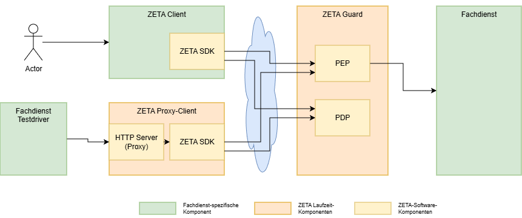
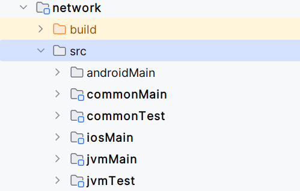

 <br/>

# zeta-sdk

This document describes how to use the ZETA SDK, and how to build and run the provided
test- and demo-clients.

## Introduction

The ZETA Client SDK is designed to be integrated into existing and new client applications
that need to access a TI service based on the new Zerotrust (or ZETA) architecture.

The SDK aims to encapsulate the ZETA requirements and shield the application from it,
while at the same time allowing the client to reuse existing functionality that may already
be implemented, like the specific storage, configuration, or getting an SM(C)-B token.
While implementations for those topics are provided, due to the modular nature and the
configuration parameters when instantiating the ZETA SDK, client-specific implementations can
be injected into the SDK.

The client is written in kotlin multiplatform, to provide a single implementation of the
ZETA functionality, but providing examples on how the client can be integrated into
a Java application and as a C++ library.

The following sections give an overview on the repository content, as well as how to build
the different clients and how to use them.

[[_TOC_]]

## Architecture overview

The Zeta Client SDK is build with Kotlin Multiplatform (KMP) to target multiple platforms (iOS, Android and JVM),
while reducing the duplicated code.
By sharing core logic across platforms, minimizing the maintenance overhead and ensure consistent behaviour for all
clients.



## Contents of the Repository

###  Functional Folders

Folders for core SDK functionality and clients.

| Verzeichnis      | Beschreibung                       |
|------------------|------------------------------------|
| zeta-sdk         | Core SDK Modul                     |
| zeta-client      | Code for the demo client           |
| zeta-client-java | Code for the Java client           |
| zeta-client-cpp  | Code for the C++ client            |
| zeta-client      | Code for the demo client           |
| zeta-testdriver  | Code for the test proxy client     |
| docs             | Further code-related documentation |

The different clients serve different purposes:

- The demo client is a pure kotlin client and running in a JVM, and features all the functions to access the test Fachdienst
- The proxy client is running in a container and works as an HTTP proxy, to be used in testing.
- The Java client is a Proof-of-concept and shows how to configure and use the client from a Java application, but only implements the hellozeta call of the test Fachdienst.
- The C++ client is a Proof-of-concept and shows how to configure and use the client from a C++ application, but also only implements the hellozeta call

The clients, how to build and how to use them are described in more detail below.

Here are the folders for the different modules:

| Folder              | Description                                                |
|---------------------|------------------------------------------------------------|
| common              | commonly used code like logging and platform configuration |
| asl                 | ASL implementation                                         |
| attestation         | Attestation module                                         |
| authentication      | authentication module                                      |
| client-registration | Modul for the client registration                          |
| configuration       | Runtime configuration                                      |
| crypto              | Crypto functionality                                       |
| flow-controller     | Core SDK controller logic                                  |
| network             | Network module (e.g. HttpClient)                           |
| storage             | Storage module                                             |
| tpm                 | Access to the TPM or alternate implementations             |

### Technical

| Folder      | Description               |
|-------------|---------------------------|
| gradle      | Gradle installation       |
| build-logic | Gradle/Kotlin build logic |
| build       | build output              |

### Structure of the modules

The different modules contain, depending on the respective setup, platform-specific subfolders.

Here an example from the network module:



The different subfolders contain either commonly used code, which is at least the API of the module,
or the platform specific implementations


| Verzeichnis | Beschreibung                                                        |
|------------|---------------------------------------------------------------------|
| common     | gemeinsame API                                                      |
| jvm        | Code specific for the JVM-implementation                            |
| desktop    | Code specific for the desktop implementations (windows, linux, mac) |
| android    | Code specific for the Android-implementation                        |
| ios        | Code specific for the iOS-implementation                            |

## Integrating into your own code

If you want to include the SDK into your own Java projects, you can get it from
a maven repository already.

To do this, add this dependency to your maven pom file:
````
<!-- https://mvnrepository.com/artifact/de.gematik.zeta/zeta-sdk-jvm -->
<dependency>
  <groupId>de.gematik.zeta</groupId>
  <artifactId>zeta-sdk-jvm</artifactId>
  <version>x.y.z</version>
</dependency>
````
Here is [The Maven repository homepage](https://mvnrepository.com/artifact/de.gematik.zeta/zeta-sdk-jvm).


## The clients

The next sections contain information about the clients.

All clients implement at least the "hellozeta" call to show how the integration of the
kotlin code/library is done.

The demo-client can use the functional interface of the Test Fachdienst (test resource server),
and can thus create presciptions, show them, modify them, and delete them.

The test-driver is a proxy client that just forwards the HTTP(S) requests it receives
to the given resource server, but using the PEP endpoint and the necessary ZETA and ASL
protocols. In addition, it also provides the websockets interface.

The Java and C++ clients are proof-of-technology clients that only implement the
"hellozeta" call, to show how the SDK can be integrated into clients with this technology.

### Build Configuration

The build process is using the gradle tool. It can be customized using some
values in the "gradle.properties" and the "local.properties" file.

#### gradle.properties

The gradle.properties file contains switches that enable or disable building some
of the platforms. These can be used to improve the build speed.

````
de.gematik.zeta.sdk.build-logic.enableAndroid=true
de.gematik.zeta.sdk.build-logic.enableIOS=true
de.gematik.zeta.sdk.build-logic.enableNative=true
````

Here the "enableNative" switch enables the C++ build components.

#### local.properties

In the local.properties file the location of the Android Sdk can be set, for example
like so on a windows machine:
````
sdk.dir=C\:\\Users\\ABCDE\\AppData\\Local\\Android\\Sdk
````

### Client Configuration

All clients use the same set of configuration values, which are described here.
These are either configured as environment variables, or in a configuration file.

Note that these items only concern the provided demo- and test-clients.
In a real client (like a practice management system) these should be provided by the
"surrounding" client application.

Here are the items you need to adapt:

| Value                     | Description                                                                                                                     | Example                                                    |
|---------------------------|---------------------------------------------------------------------------------------------------------------------------------|------------------------------------------------------------|
| FACHDIENST_URL            | URL of the resource server as reachable via the PEP                                                                             | https://fachdienst.host.example.com/pep/fachdienst_url/api |
| SMB_KEYSTORE_FILE         | Path to the SM-B Certificate-File (in .p12 format)                                                                              | /smcb-certificates.p12                                     |
| SMB_KEYSTORE_ALIAS        | Alias of the key in the SM-B Certificate file                                                                                   |                                                            |
| SMB_KEYSTORE_PASSWORD     | Password for the private key                                                                                                    |                                                            |
| SMCB_BASE_URL             | base url of the konnektor webservice interface (needs to include the "/ws")                                                     |                                                            |
| SMCB_MANDANT_ID           | <mandanten-ID>  for connector calls                                                                                             |                                                            |
| SMCB_CLIENT_SYSTEM_ID     | <client_system_id>  for connector calls                                                                                         |                                                            |
| SMCB_WORKSPACE_ID         | <workspace_id> for connector calls                                                                                              |                                                            |
| SMCB_USER_ID              | <user-id> - is required for SMC-B but is being ignored                                                                          |                                                            |
| SMCB_CARD_HANDLE          | <smcb-card-handle>                                                                                                              |                                                            |
| POPP_TOKEN                | Value of a PoPP Tokens, which is given to the PEP (optional)                                                                    | eyJhbGciOiJFUzI1NiI......                                  |
| DISABLE_SERVER_VALIDATION | If set to "true" gesetzt, TLS server TLS certificate checks are disabled (for testing only!)                                    |                                                            |
| WS_SERVER_CONTEXT_PATH    | Specifies the base context to target the resource server. It is used in the Java client to prefix STOMP Websockets destinations | /testfachdienst                                            |

Note that two sets of configuration variables for the SM(C)-B client authentication are provided,
one for the SM-B certificate file, another for the SMC-B connector interface.
**Only one set of these needs to be provided**

## The demo client

The demo client shows the use of the SDK in a kotlin multiplatform environment.
It implements the functionality that is exposed by the Test-Fachdienst.

### Prerequisites

* A PC with Windows, Linux, or Mac
* Installed Java Development Kit (JDK)
* git client to clone the source repo, or a copy of the source repo content
* Installed Android Software Development Kit (SDK) with configured ANDROID_HOME environment variable (optional)

Note: the SDK and the test client can be built without Android SDK.

### Building

#### Dependencies and configuration

The main configuration of the test client are the

- Endpoint of the Fachdienst
- SM-B file location, alias and password

Those are being provided using a configuration file or environment variables.

#### Quickstart

After creating the configuration file the test client can be started like so:

````
./gradlew :zeta-client:jvmRun -DmainClass="de.gematik.zeta.client.ZetaClientAppKt" --args='--ZETA_ENV_FILE=<Name-der-Parameter-Datei>
````

The parameter file contains the configuration parameters as described above:

````
ENVIRONMENTS=<resource_server_1_api_endpoint> <resource_server_2_api_endpoint> ...

SMB_KEYSTORE_FILE=<sm-b-keystore-file>.p12
SMB_KEYSTORE_ALIAS=<key-alias-im-keystore-file>
SMB_KEYSTORE_PASSWORD=<keystore-password>

SMCB_BASE_URL=<basis_url_des_konnektor_webservice_interface>
SMCB_MANDANT_ID=<mandanten-ID>
SMCB_CLIENT_SYSTEM_ID=<client_system_id>
SMCB_WORKSPACE_ID=<workspace_id>
SMCB_USER_ID=<user-id>
SMCB_CARD_HANDLE=<smcb-card-handle>

DISABLE_SERVER_VALIDATION=true
POPP_TOKEN=eyJhbGciOiJ......
````

*Note: the resource server URL is here named differently as 'ENVIRONMENTS', as there are multiple
resource servers possible, not just a single 'FACHDIENST_URL'*

The variable 'ENVIRONMENTS' thus contains multiple resource server endpoints, separate by a space.
These can be selected in the UI of the demo client.

### Step-by-Step instructions

#### Building the SDK and Deployment into a local maven repository

This step does not need an Android SDK.

````
./gradlew publishJvmPublicationToMavenLocal
./gradlew publishKotlinMultiplatformToMavenLocal
````

#### Remote Maven Repository

Hinweis: sollten Sie das ZETA SDK in ein eigenes Remote Repository submitten wollen, so müssen sie die folgende Konfiguration in der build-logic anpassen:

| Verzeichnis                                               | Datei                    | Zeile/Variable                     | Beschreibung                                                | Beispiel                                                     |
|-----------------------------------------------------------|--------------------------|------------------------------------|-------------------------------------------------------------|--------------------------------------------------------------|
| build-logic/build-logic/src/main/kotlin/com/ey/buildlogic | BuildLogicPlugin.kt      | 242<br/>URL des Maven Repositories | URL des remote Maven Repositories                           | "https://<repository-host>/api/v4/projects/3/packages/maven" |


#### Complete Setup

The full tests and setups need an Android SDK:

##### Complete Build

````
./gradlew build
````

##### Running all Tests

````
./gradlew testAll
````

## The test driver client (proxy client)

In this section we describe how you can create a container with a proxy client containing the SDK and
exposing the SDK APIs and other test-related actions as HTTP endpoints. This proxy client is
used in various test situations.

### Proxy client features

Here is an overview on how the proxy client sits between a test driver and the zeta guard.
The purpose of the proxy client is to encapsulate the ZETA protocol and make testing of the
zeta guard setup easier.

TODO: diagram how the proxy client sits between a test driver and the zeta guard

Requests to the Fachdienst enter the proxy client as normal HTTP requests, get forwarded to the
ZETA guard using the ZETA and optionally ASL protocol, the ZETA guard validates them and forwards
them to the Fachdienst backend. This facilitates end-to-end testing and testing whether the ZETA guard
setup is correct.

The proxy client exposes a number of HTTP endpoints that allow on one side forwarding requests to
the Fachdienst, but also control the client and extract information necessary for testing.

| endpoint                     | access type      | purpose                                                                                                                                                                                                                             |
|------------------------------|------------------|-------------------------------------------------------------------------------------------------------------------------------------------------------------------------------------------------------------------------------------|
| /proxy/*                     | all HTTP methods | Forward any requests path after the "/proxy/" part to the Fachdienst. According to the SDK API, includes discovery, client registration and authentication if not already done.<br/>Note this also includes the websocket protocol. |
| /testdriver-api/discover     | GET              | Just the discovery part of the protocol, i.e. reading the .well-known files                                                                                                                                                         |
| /testdriver-api/register     | GET              | Perform client registration (includes discovery if not already done)                                                                                                                                                                |
| /testdriver-api/authenticate | GET              | Retrieve and store an access token (includes client registration and discovery if not already done)                                                                                                                                 |
| /testdriver-api/storage      | GET              | Retrieve the stored data (like client instance key, access token etc)                                                                                                                                                               |
| /testdriver-api/reset        | GET              | forget all the stored information, so any call will start triggering a discovery, client registration and authentication again                                                                                                      |
| /health                      | GET              | health API for kubernetes                                                                                                                                                                                                           |

*Note: in coming project milestones the paths may change or be extended to accomodate for multiple client instance running in parallel*

### Building the test driver (proxy client) container image

Note that building the container image in an automated CI/CD process is preferred
over these manual steps. The file .gitlab-ci.yml shows how this can be done.

#### Prerequisites

In general the requisites are required for building the test driver as are for the demo client.

* A PC with Windows, Linux, or Mac
* Installed Java Development Kit (JDK)
* git client to clone the source repo, or a copy of the source repo content
* Installed Android Software Development Kit (SDK) with configured ANDROID_HOME environment variable (optional)

Also this tools is required to create the container image:

* Docker build Tool

#### Building

##### Building the libraries

The necessary libraries can be built with

````
./gradlew clean jar copyRuntimeLibs
````

The artifacts are then in

````
**/build/libs/*.jar
**/build/runtime-libs/*.jar
````

##### Building the containers

The container can then be built using the dockerfile:
````
docker build -f zeta-testdriver/Dockerfile .
````

### Executing the proxy client

The container can be built using the deployment.yml described here.

The configuration items in the deployment.yml file that need to be set are
described above in the Configuration section.

In the example below these configuration items are set via helm variables, so they can be used
depending on the environment.

The SMB keystore file is being mounted as kubernetes secret.

Other values are also set by helm variables, like the used image repository, version, etc.

Here's the example Deployment descriptor:
```
apiVersion: apps/v1
kind: Deployment
metadata:
  name: testdriver
  labels:
    component: testdriver
spec:
  replicas: 1
  selector:
    matchLabels:
      app: testdriver
  template:
    metadata:
      labels:
        app: testdriver
        component: testdriver
      {{- if .Values.devMode }}
      annotations:
        zeta.dev/rollout-timestamp: "{{ now | unixEpoch }}"
      {{- end }}
    spec:
      securityContext:
        fsGroup: 1000
      imagePullSecrets:
        - name: gitlab-registry-credentials-zeta-group
      containers:
        - name: testdriver
          image: "{{ default (printf "%s%s" .Values.global.registry_host .Values.registry_name) .Values.image.registry }}{{ .Values.image.repository }}:{{ .Values.image.tag }}"
          imagePullPolicy: "{{ .Values.image.pullPolicy }}"
          ports:
            - containerPort: {{ .Values.containerPort }}
          volumeMounts:
            - name: smcb-keystore
              mountPath: "/smcb-certificates.p12"
              subPath: "smcb-certificates.p12"
              readOnly: true
          env:
            - name: FACHDIENST_URL
              value: {{ .Values.fachdienst_url }}
            - name: DISABLE_SERVER_VALIDATION
              value: {{ quote .Values.disableServerValidation }}
            - name: POPP_TOKEN
              value: {{ .Values.PoppToken | quote }}
            - name: SMB_KEYSTORE_FILE
              value: "/smcb-certificates.p12"
            - name: SMB_KEYSTORE_ALIAS
              value: "zeta.c_smcb_aut"
            - name: SMB_KEYSTORE_PASSWORD
              valueFrom:
                secretKeyRef:
                  name: pdp-smcb-keystore
                  key: password
            - name: SMCB_BASE_URL
              value: {{ .Values.connector_base_url }}
            - name: SMCB_MANDANT_ID
              value: {{ .Values.connector_mandant_id }}
            - name: SMCB_CLIENT_SYSTEM_ID
              value: {{ .Values.connector_client_system_id }}
            - name: SMCB_WORKSPACE_ID
              value: {{ .Values.connector_workspace_id }}
            - name: SMCB_USER_ID
              value: {{ .Values.connector_user_id }}
            - name: SMCB_CARD_HANDLE
              value: {{ .Values.connector_card_handle }}
      volumes:
        - name: smcb-keystore
          secret:
            secretName: pdp-smcb-keystore
            items:
              - key: keystore
                path: "smcb-certificates.p12"
```

The corresponding service.yml looks as follows:

```
apiVersion: v1
kind: Service
metadata:
  name: testdriver
spec:
  selector:
    app: testdriver
  ports:
    - name: http
      port: 80
      targetPort: 8080
  type: ClusterIP

```

Note: in case of doubt, have a look at the current versions of these files
in the zeta-guard-helm repository.

### Continuous Integration

The continuous integration pipeline can be set up with the
included .gitlab-ci.yml file, that you need to adapt to your development process.

````
.gitlab-ci.yml
````

## The Java client

The Java client shows how the ZETA SDK can be integrated into a Java-based application. It implements only the "hellozeta" call of the
Test Fachdienst.

The Java class "Main" in zeta-client-java/main/java/de/gematik/zeta shows how the integration can be done.

### Building the Java client

The Java client can be built with

````
./gradlew zeta-client-java:build
````

and it can be run with

````
./gradlew zeta-client-java:run
````

Without any command line parameters, the configuration (as described above) needs to
be provided with environment variables.

It if is run with a command line argument of a configuration file like so:

````
./gradlew zeta-client-java:run --args='config.file'
````

Then it will read the configuration from the given filename.

Note: when run from gradle, the filename is relative to the *build* directory, use an absolute path, or relative to
the build directory, like `../config.file`

## The C++ client

The C++ client shows how the ZETA SDK can be integrated into a C++-based application. It implements only the "hellozeta" call of the
Test Fachdienst.

The C++ file "hello.cpp" in zeta-client-cpp/src/main/cpp shows how to integrate the SDK.

### Building the C++ client

The C++ client can be built with

````
./gradlew zeta-client-cpp:build
````

and it can be run with

````
./gradlew zeta-client-cpp:allTests
````

## Usage of the SDK

The ZETA SDK consists of a number of modules as described above.
The entry into the ZETA-SDK is the class *ZetaSdk*. It provides a
builder interface that can be used to configure the SDK.

The build interface includes the URL of the resource server.
Using different URLs, a client can create multiple instances of the
SDK, one per resource server.

### Client-API

The following example shows in the kotlin version how a resource can be called.

The configuration includes config objects that allow reusing existing functionality
where available. For example, we assume that a client implementation in the
context of the TI already has ways to store items securely, or how to
create an SM(C)-B token. So these functions can be injected.

The exact configuration items are described in the sourcecode.

`````
class ZetaSdkTest {
    @Test
    @Ignore
    fun sdk_halloZetaTest() = runTest {
        // Arrange
        val sdk = ZetaSdk.build(
            "https://<resource-url>",
            BuildConfig(
                "demo_client",
                "0.2.0",
                "client-sdk",
                StorageConfig(),
                object : TpmConfig {},
                AuthConfig(
                    listOf(
                        "zero:audience",
                    ),
                    30,
                    true,
                    SmbTokenProvider(SmbTokenProvider.Credentials("", "", "")),
                ),
            ),
        )

        // Act
        val client = sdk.httpClient {
            logging(
                LogLevel.ALL,
                object : Logger {
                    override fun log(message: String) {
                        println("log:" + message)
                    }
                },
            )
        }

        val helloResult = client.get("/hellozeta")
            .bodyAsText()
    }
}
`````

### API Overview

This section gives an overview on how to use the API.
More details can be found in the source code.

Note: this API is an intermediary target API and can deviate from the API in tne source code,
depending on the state of the implementation according to the project milestones.

### Public API

The ZETA API offers the following public API:

| Operation                    | Description                                                                                                                                               | Return value         | Errors                                                                                                                                                                                   |
|------------------------------|-----------------------------------------------------------------------------------------------------------------------------------------------------------|----------------------|------------------------------------------------------------------------------------------------------------------------------------------------------------------------------------------|
| build(resource, BuildConfig) | static method to create a new SDK client instance                                                                                                         |
| forget()                 | static method to clear all cached information for the FQDN, like instance key, well-known files, or access tokens. This method is mostly used for testing |
| discover()                   | Perform discovery and configuration, i.e. mainly reading the well-known files                                                                             |
| register()                   | Perform client registration; includes discovery and configuration if not already done                                                                     |
| authenticate()               | perform the authentication; includes client registration and discovery and configuration if not alreaady done                                             |
| httpClient()                 | Returns an HttpClient with overloaded method that implement the ZETA specific protocol; this includes authentication etc if not already done              |                      |
| close()                      | Closing the ZETA SDK client without forgetting the cached information                                                                                     | -                    | error codes                                                                                                                                                                              |

Inside the HTTP operations as provided by the HttpClient, the discovery, client registration and authentication are performed automatically.
The methods discover(), register(), and authenticate() are idempotent.
Providing them separately allows the client to implement flexible UI flows in case there is any client interaction needed.
For example the authentication could be done at start without an actual call to the Fachdienst, so that any later Fachdienst call
is then uninterrupted by manual interaction.

### Configuration

The configuration is done by passing the BuildConfig object to the ZetaSdkClient.
This object contains the following attributes and sub-objects.

| BuildConfig Attribut   | Description                                                                              |
|------------------------|------------------------------------------------------------------------------------------|
| productId              | The gematik Product-ID                                                                   |
| productVersion         | The version of the product                                                               |
| clientName             | The name of the client                                                                   |
| storageConfig          | An object providing configuration for secure storage (e.g. of the auth token)            |
| tpmConfig              | Information about the client's TPM                                                       |
| authConfig             | Konfiguration des Authentication Prozesses, wie Token scopes, Expiry etc.                |
| http_config            | Konfigurationsparameter für den HTTP Client wie timeouts, retries etc.                   |
| registrationCallback   | a function that is called when a user interaction is required during client registration |
| authenticationCallback | a function that is called when a user interaction is required during authentication      |

Note: in implementation phase 1 callbacks are not expected. In implementation phase 2
callbacks may be added e.g. for pushed authentication requests to the IDP.
Details are still to be determined.

### AuthConfig

The AuthConfig object configures the authentication process:

| Attribute              | Description                                                                                  |
|------------------------|----------------------------------------------------------------------------------------------|
| scopes                 | Scope-values for the Access Tokens                                                           |
| exp                    | The expiration time of the JWT as lifetime duration in seconds                               |
| enableAslTracingHeader | this is required for non-production environment, so that ASL keys can be accessed in testing |
| subjectTokenProvider   | a class that provides a subject token, either SM-B or SMC-B depending on the implementation  |


### StorageConfig

This interface provides a simple Map-type storage interface that is used
to save the session information.

### ZetaHttpClientBuilder

This object configures the HTTP client. It contains three sub-objects:

#### NetworkConfig

This object contains configuration for e.g. retries and timeouts.

#### SecurityConfig

This object allows adding additional CAs that are validated against for the TLS certificate.

#### MonitoringConfig

This object determines the log level for backend requests.

## License

(C) EY Strategy and Transactions GmbH, 2025, licensed for gematik GmbH

Apache License, Version 2.0

See the [LICENSE](./LICENSE) for the specific language governing permissions and limitations under the License

## Additional Notes and Disclaimer from gematik GmbH

1. Copyright notice: Each published work result is accompanied by an explicit statement of the license conditions for use. These are regularly typical conditions in connection with open source or free software. Programs described/provided/linked here are free software, unless otherwise stated.
2. Permission notice: Permission is hereby granted, free of charge, to any person obtaining a copy of this software and associated documentation files (the "Software"), to deal in the Software without restriction, including without limitation the rights to use, copy, modify, merge, publish, distribute, sublicense, and/or sell copies of the Software, and to permit persons to whom the Software is furnished to do so, subject to the following conditions:
   1. The copyright notice (Item 1) and the permission notice (Item 2) shall be included in all copies or substantial portions of the Software.
   2. The software is provided "as is" without warranty of any kind, either express or implied, including, but not limited to, the warranties of fitness for a particular purpose, merchantability, and/or non-infringement. The authors or copyright holders shall not be liable in any manner whatsoever for any damages or other claims arising from, out of or in connection with the software or the use or other dealings with the software, whether in an action of contract, tort, or otherwise.
   3. We take open source license compliance very seriously. We are always striving to achieve compliance at all times and to improve our processes. If you find any issues or have any suggestions or comments, or if you see any other ways in which we can improve, please reach out to: ospo@gematik.de
3. Please note: Parts of this code may have been generated using AI-supported technology. Please take this into account, especially when troubleshooting, for security analyses and possible adjustments.
