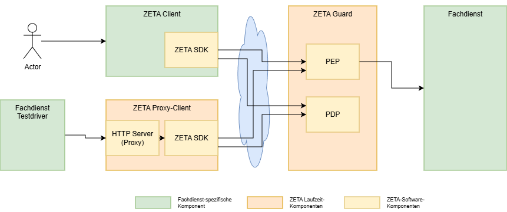
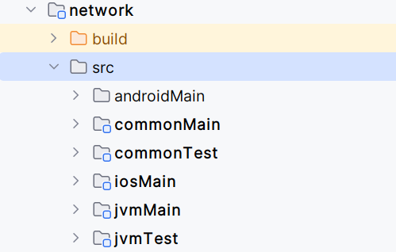

# zeta-sdk

This document describes how to use the ZETA SDK, and how to build and run the provided
test- and demo-clients.

## Introduction

The ZETA Client SDK is designed to be integrated into existing and new client applications
that need to access a TI service based on the new Zerotrust (or ZETA) architecture.

The SDK aims to encapsulate the ZETA requirements and shield the application from it,
while at the same time allowing the client to reuse existing functionality that may already
be implemented, like the specific storage, configuration, or getting an SM(C)-B token.
While implementations for those topics are provided, due to the modular nature and the
configuration parameters when instantiating the ZETA SDK, client-specific implementations can
be injected into the SDK.

The client is written in kotlin multiplatform, to provide a single implementation of the
ZETA functionality, but providing examples on how the client can be integrated into
a Java application and as a C++ library.

The following sections give an overview on the repository content, as well as how to build
the different clients and how to use them.

[[_TOC_]]

### Notes

- In release 1.2.2 the SmcbSubjectToken provider was removed as it was a testing tool only and also
did not fully implement the requirements for a production connector connection. As a replacement
we point to this
[github repo](https://github.com/gematik/zeta-cli/tree/main/connector/src) that has already been
tested with connectors (but still needs to be wrapped into a CustomSubjectTokenProvider)

## Architecture overview

The Zeta Client SDK is build with Kotlin Multiplatform (KMP) to target multiple platforms (iOS, Android and JVM),
while reducing the duplicated code.
By sharing core logic across platforms, minimizing the maintenance overhead and ensure consistent behaviour for all
clients.



## Contents of the Repository

###  Functional Folders

Folders for core SDK functionality and clients.

| Verzeichnis           | Beschreibung                                                                                                                |
|-----------------------|-----------------------------------------------------------------------------------------------------------------------------|
| zeta-sdk              | Core SDK Module                                                                                                             |
| zeta-client           | Code for the demo client                                                                                                    |
| zeta-client-java      | Code for the Java client                                                                                                    |
| zeta-client-cpp       | Code for the C++ client (HTTP CRUD and WebSocket demo)                                                                      |
| zeta-nativeclient-cpp | Standalone C++ client using the SDK shared library directly. Samples can be run using a Makefile for (macOS, Linux, Windows) |
| zeta-testdriver       | Code for the test proxy client and load test driver                                                                         |
| attestation-service   | Code for the attestation service for Windows and Linux                                                                      |
| docs                  | Further code-related documentation                                                                                          |

The different clients serve different purposes:

- The demo client is a pure kotlin client and running in a JVM, and features all the functions to access the test Fachdienst
- The proxy client is running in a container and works as an HTTP proxy, to be used in testing.
- The Java client is a Proof-of-concept and shows how to configure and use the client from a Java application, but only implements the hellozeta call of the test Fachdienst.
- The C++ client demonstrates how to integrate the SDK from a C++ application.
  It implements HTTP CRUD (GET, POST, PUT, PATCH, DELETE, HEAD, OPTIONS)
  and WebSocket STOMP communication with a resource server.

The clients, how to build and how to use them are described in more detail below.

Here are the folders for the different modules:

| Folder              | Description                                                |
|---------------------|------------------------------------------------------------|
| common              | commonly used code like logging and platform configuration |
| asl                 | ASL implementation                                         |
| attestation         | Attestation module                                         |
| authentication      | authentication module                                      |
| client-registration | Modul for the client registration                          |
| configuration       | Service discovery: reading the `.well-known` files         |
| crypto              | Crypto functionality                                       |
| flow-controller     | Core SDK controller logic                                  |
| network             | Network module (e.g. HttpClient)                           |
| storage             | Storage module                                             |
| tpm                 | Access to the TPM or alternate implementations             |
| notifications       | Push notification module                                   |

### Technical

| Folder      | Description               |
|-------------|---------------------------|
| gradle      | Gradle installation       |
| build-logic | Gradle/Kotlin build logic |
| build       | build output              |

### Structure of the modules

The different modules contain, depending on the respective setup, platform-specific subfolders.

Here an example from the network module:



The different subfolders contain either commonly used code, which is at least the API of the module,
or the platform specific implementations


| Verzeichnis | Beschreibung                                                        |
|------------|---------------------------------------------------------------------|
| common     | gemeinsame API                                                      |
| jvm        | Code specific for the JVM-implementation                            |
| desktop    | Code specific for the desktop implementations (windows, linux, mac) |
| android    | Code specific for the Android-implementation                        |
| ios        | Code specific for the iOS-implementation                            |

## Integrating into your own code

### kotlin

If you want to include the SDK into your own kotlin projects, you can get it from
a maven repository already.

To do this, add this dependency to your maven pom file:
````
<!-- https://mvnrepository.com/artifact/de.gematik.zeta/zeta-sdk-jvm -->
<dependency>
  <groupId>de.gematik.zeta</groupId>
  <artifactId>zeta-sdk</artifactId>
  <version>x.y.z</version>
</dependency>
````
Here is [The Maven repository homepage](https://mvnrepository.com/artifact/de.gematik.zeta/zeta-sdk-jvm).

### Java

If you want to include the SDK into your own Java projects, you can get it from
a maven repository already.

To do this, add this dependency to your maven pom file:
````
<!-- https://mvnrepository.com/artifact/de.gematik.zeta/zeta-sdk-jvm -->
<dependency>
  <groupId>de.gematik.zeta</groupId>
  <artifactId>zeta-sdk-jvm</artifactId>
  <version>x.y.z</version>
</dependency>
````

Note that the artifactId has an additional `-jvm` compared to the kotlin version.

Here is [The Maven repository homepage](https://mvnrepository.com/artifact/de.gematik.zeta/zeta-sdk-jvm).

### C++

The build process for the C++ SDK creates a number of DLL files, that need to be linked
to your C++ application. This highly depends on your own build process.

The C++ API is defined in a single generated header file:
- `libzeta_sdk_api.h` (Linux / macOS)
- `zeta_sdk_api.h` (Windows)

This header is automatically generated and enriched with the SDK type definitions
during the SDK build process.

## The clients

The next sections contain information about the clients.

All clients implement at least the "hellozeta" call to show how the integration of the
kotlin code/library is done. The Java client is a proof-of-technology client that implements the hellozeta call and
WebSocket STOMP communication. The C++ native client additionally implements full HTTP
CRUD operations (GET, POST, PUT, DELETE, HEAD, OPTIONS).

The demo-client can use the functional interface of the Test Fachdienst (test resource server),
and can thus create presciptions, show them, modify them, and delete them.

The testdriver is a proxy client that just forwards the HTTP(S) requests it receives
to the given resource server, but using the PEP endpoint and the necessary ZETA and ASL
protocols. In addition, it also provides the websockets interface.
It can be run in a container, allowing for easy proxying of functional test clients
through ZETA SDK and ZETA Guard to an actual resource server. A ready to use
container image is provided.

The Java and C++ clients are proof-of-technology clients that only implement the
"hellozeta" call, to show how the SDK can be integrated into clients with this technology.
In addition, they use the websockets functionality to connect to the test resource server.

### Build Configuration

The build process is using the gradle tool. It can be customized using some
values in the "gradle.properties" and the "local.properties" file.

#### Publishing the SDK locally

Before building any client that depends on the SDK via Maven, publish it to the local Maven repository:
```
./gradlew publishJvmPublicationToMavenLocal
```

#### gradle.properties

The gradle.properties file contains switches that enable or disable building some
of the platforms. These can be used to improve the build speed.

````
de.gematik.zeta.sdk.build-logic.enableAndroid=true
de.gematik.zeta.sdk.build-logic.enableIOS=true
de.gematik.zeta.sdk.build-logic.enableNative=true
````

Here the "enableNative" switch enables the C++ build components.

The optional Android push-notification feature is not configured in `gradle.properties`; it
is enabled through a `ZETA_GOOGLE_SERVICES_JSON=` line in the runtime config file
`zeta-client/src/androidMain/assets/zeta.env`. See
[Push notifications (optional, Android)](#push-notifications-optional-android) for what
this enables and the additional setup it requires.

#### local.properties

In the local.properties file the location of the Android Sdk can be set, for example
like so on a windows machine:
````
sdk.dir=C\:\\Users\\ABCDE\\AppData\\Local\\Android\\Sdk
````

### Client Configuration

All clients use the same set of configuration values, which are described here.
These are either configured as environment variables, or in a configuration file.

Note that these items only concern the provided demo- and test-clients.
In a real client (like a practice management system) these should be provided by the
"surrounding" client application.

Here are the items you need to adapt:

| Value                     | Description                                                                                                                                            | Example                                                    |
|---------------------------|--------------------------------------------------------------------------------------------------------------------------------------------------------|------------------------------------------------------------|
| FACHDIENST_URL            | URL of the resource server as reachable via the PEP                                                                                                    | https://fachdienst.host.example.com/pep/fachdienst_url/api |
| SMB_KEYSTORE_FILE         | Path to the SM-B Certificate-File (in .p12 format)                                                                                                     | /smcb-certificates.p12                                     |
| SMB_KEYSTORE_ALIAS        | Alias of the key in the SM-B Certificate file                                                                                                          |                                                            |
| SMB_KEYSTORE_PASSWORD     | Password for the private key                                                                                                                           |                                                            |
| SMB_KEYSTORE_B64          | base64-encoded Keystore being used in the load driver; must be present, empty string if not used.                                                      |                                                            |
| POPP_TOKEN                | Value of a PoPP Tokens, which is given to the PEP (optional)                                                                                           | eyJhbGciOiJFUzI1NiI......                                  |
| DISABLE_SERVER_VALIDATION | If set to "true", TLS server TLS certificate checks are disabled (for testing only!)                                                                   |                                                            |
| WS_SERVER_CONTEXT_PATH    | Specifies the base context to target the resource server. It is used in the Java client to prefix STOMP Websockets destinations                        | /testfachdienst                                            |
| WS_BASE_URL               | Defines the Websocket base URL (including protocol: ws/wss)                                                                                            | wss://host/resource/ws                                     |
| ASL_PROD                  | Defines whether the client runs in Productive or Non Productive mode. If set to "false" exposes the ASL symmetric keys: K2_c2s_app_data and K2_s2c_app | by default is set to "true" (productive environment)       |
| STORAGE_AES_KEY           | Base64-encoded AES-256 key used to encrypt session data at rest                                                                                        | 7aae7xXr8rnzVqjpYbosS0CFMrlprkD7jbVotm0fd                  |
| REQUIRED_ROLE_OID         | Role-OID that the TI certificate must contain. Required for ASL handshake validation                                                                   | 1.2.276.0.76.4.156                                         |
| OIDC_IDP_ISS              | Issuer identifier of the OIDC IDP used for the email-binding authentication flow                                                                       | https://fachdienst.host.example.com/sekidp                 |
| OIDC_BASE_URI             | Base URI the client's system browser flow redirects back to (callback endpoint)                                                                        | http://localhost:8090/cb/demo                              |
| OIDC_IDP_ALIAS            | Alias of the IDP as configured in the Keycloak broker chain                                                                                            | zeta-sekidp-oidc                                           |
| AUTH_MODE                 | Selects the authentication mode the client uses to obtain the subject token: `SMB` for SM-B/SMC-B or `OIDC` for the OIDC                               | SMB                                                        |


## The demo client

The demo client shows the use of the SDK in a kotlin multiplatform environment.
It implements the functionality that is exposed by the Test-Fachdienst.

### Prerequisites

* A PC with Windows, Linux, or Mac
* Installed Java Development Kit (JDK)
* git client to clone the source repo, or a copy of the source repo content
* Installed Android Software Development Kit (SDK) with configured ANDROID_HOME environment variable (optional)

Note: the SDK and the test client can be built without Android SDK.

### Push notifications (optional, Android)

The Android demo client can receive push notifications via Firebase Cloud Messaging (FCM).
This feature is **optional and disabled by default** — the default build has no dependency on
Firebase and needs no Firebase configuration. It is enabled by setting a
`ZETA_GOOGLE_SERVICES_JSON=` line in `zeta-client/src/androidMain/assets/zeta.env` (the same
runtime config file the app reads) that points at a valid `google-services.json`; enabling
it applies the `com.google.gms.google-services` Gradle plugin.

**What the feature adds when enabled**

* the Firebase Cloud Messaging dependency and the `com.google.gms.google-services` plugin,
* the `ZetaFirebaseMessagingService` (receives messages and posts a system notification),
* the `POST_NOTIFICATIONS` runtime-permission prompt (Android 13+) and the notification
  channel / resources.

When the feature is disabled, none of the above is compiled in: the Firebase code lives in the
separate `zeta-client/src/androidNotifications` source set, and the build script compiles in
exactly one variant of the integration provider — the Firebase-backed one when enabled, a no-op
one from `zeta-client/src/androidNoNotifications` otherwise. The selection happens entirely at
compile time (no reflection), and `de.gematik.zeta.client.notification.ZetaNotifications`
exposes the result.

**How to enable it**

1. Create a Firebase project and register an Android app with the applicationId
   `de.gematik.zeta.client` (see the [Firebase console](https://console.firebase.google.com/)).

2. Download the generated `google-services.json` and store it somewhere **outside** the
   repository (it is environment specific and contains project credentials — do not commit
   it).

3. Add a `ZETA_GOOGLE_SERVICES_JSON=` line pointing at that file to
   `zeta-client/src/androidMain/assets/zeta.env`:

   ````
   ZETA_GOOGLE_SERVICES_JSON=/path/to/google-services.json
   ````

   Android must also be enabled (`de.gematik.zeta.sdk.build-logic.enableAndroid=true`).
   When the line is absent or empty (or the `zeta.env` file is missing entirely), the
   feature is disabled and the build needs no Firebase configuration; when it points to a
   non-existent file, the build prints a warning and keeps the feature disabled. The build
   copies the file to `zeta-client/google-services.json` (where the
   `com.google.gms.google-services` plugin expects it) — that copy is git-ignored.

4. Build and install the Android app as usual. The FCM push key is deliberately not logged;
   to obtain it during development, set a breakpoint in
   `ZetaFirebaseMessagingService.onNewToken` (fires on first start after install and on token
   rotation) or evaluate `FirebaseMessaging.getInstance().token` in the debugger. Use the key
   as the target when sending a test message from the Firebase console or the notification
   service.


## Platform Requirements

| Platform | Requirements           |
|-----------|------------------------|
| Android | API 28+ (Android 9.0+) |
| JVM | JDK 17+                |
| iOS | iOS 15+                |


### Android: cleartext traffic for revocation endpoints

Certificates point to their OCSP responder and CRL distribution points over plain `http://`:
the responses are CA-signed, and fetching them over HTTPS would be circular. Android blocks
cleartext by default from API 28 - the SDK's minimum - so revocation fails with
`CLEARTEXT communication to <host> not permitted by network security policy` unless the app
allows those hosts:

```xml
<!-- res/xml/network_security_config.xml, referenced from the manifest as
     <application android:networkSecurityConfig="@xml/network_security_config"> -->
<network-security-config>
  <domain-config cleartextTrafficPermitted="true">
    <domain includeSubdomains="true">ocsp.example-ca.de</domain>
    <domain includeSubdomains="true">crl.example-ca.de</domain>
  </domain-config>
</network-security-config>
```

The demo client permits cleartext for all domains

### Building

#### Dependencies and configuration

The main configuration of the test client are the

- Endpoint of the Fachdienst
- SM-B file location, alias and password

Those are being provided using a configuration file or environment variables.

#### Quickstart

After creating the configuration file the test client can be started like so:

````
./gradlew :zeta-client:jvmRun -DmainClass="de.gematik.zeta.client.ZetaClientAppKt" --args='--ZETA_ENV_FILE=<Name-der-Parameter-Datei>
````

The parameter file contains the configuration parameters as described above:

````
ENVIRONMENTS=<resource_server_1_api_endpoint> <resource_server_2_api_endpoint> ...

SMB_KEYSTORE_FILE=<sm-b-keystore-file>.p12
SMB_KEYSTORE_ALIAS=<key-alias-im-keystore-file>
SMB_KEYSTORE_PASSWORD=<keystore-password>

POPP_TOKEN=eyJhbGciOiJ......
...
````

*Note: the resource server URL is here named differently as 'ENVIRONMENTS', as there are multiple
resource servers possible, not just a single 'FACHDIENST_URL'*

The variable 'ENVIRONMENTS' thus contains multiple resource server endpoints, separate by a space.
These can be selected in the UI of the demo client.

### Step-by-Step instructions

#### Building the SDK and Deployment into a local maven repository

This step does not need an Android SDK.

````
./gradlew publishJvmPublicationToMavenLocal
./gradlew publishKotlinMultiplatformToMavenLocal
````

#### Remote Maven Repository

Hinweis: sollten Sie das ZETA SDK in ein eigenes Remote Repository submitten wollen, so müssen sie die folgende Konfiguration in der build-logic anpassen:

| Verzeichnis                                               | Datei                    | Zeile/Variable                     | Beschreibung                                                | Beispiel                                                     |
|-----------------------------------------------------------|--------------------------|------------------------------------|-------------------------------------------------------------|--------------------------------------------------------------|
| build-logic/build-logic/src/main/kotlin/com/ey/buildlogic | BuildLogicPlugin.kt      | 242<br/>URL des Maven Repositories | URL des remote Maven Repositories                           | "https://<repository-host>/api/v4/projects/3/packages/maven" |


#### Complete Setup

The full tests and setups need an Android SDK:

##### Complete Build

````
./gradlew build
````

##### Running all Tests

````
./gradlew testAll
````

## The test driver client (proxy client)

In this section we describe how you can create a container with a proxy client containing the SDK and
exposing the SDK APIs and other test-related actions as HTTP endpoints. This proxy client is
used in various test situations.

### Proxy client features

Here is an overview on how the proxy client sits between a test driver and the zeta guard.
The purpose of the proxy client is to encapsulate the ZETA protocol and make testing of the
zeta guard setup easier.

Requests to the Fachdienst enter the proxy client as normal HTTP requests, get forwarded to the
ZETA guard using the ZETA and optionally ASL protocol, the ZETA guard validates them and forwards
them to the Fachdienst backend. This facilitates end-to-end testing and testing whether the ZETA guard
setup is correct.

The proxy client exposes a number of HTTP endpoints that allow on one side forwarding requests to
the Fachdienst, but also control the client and extract information necessary for testing.

| endpoint                                     | access type      | purpose                                                                                                                                                                                                                             |
|----------------------------------------------|------------------|-------------------------------------------------------------------------------------------------------------------------------------------------------------------------------------------------------------------------------------|
| /proxy/*                                     | all HTTP methods | Forward any requests path after the "/proxy/" part to the Fachdienst. According to the SDK API, includes discovery, client registration and authentication if not already done.<br/>Note this also includes the websocket protocol. |
| /testdriver-api/discover                     | GET              | Just the discovery part of the protocol, i.e. reading the .well-known files                                                                                                                                                         |
| /testdriver-api/register                     | GET              | Perform client registration (includes discovery if not already done)                                                                                                                                                                |
| /testdriver-api/authenticate                 | GET              | Retrieve and store an access token (includes client registration and discovery if not already done)                                                                                                                                 |
| /testdriver-api/storage                      | GET              | Retrieve the stored data (like client instance key, access token etc)                                                                                                                                                               |
| /testdriver-api/reset                        | GET              | Forget all the stored information, so any call will start triggering a discovery, client registration and authentication again                                                                                                      |
| /testdriver-api/configure                    | POST             | Configures the test driver with the provided settings, including TLS validation, resource URL, and custom CA certificate                                                                                                            |
| /testdriver-api/notifications/pushers        | GET              | List the pushers registered for the authenticated user                                                                                                                                                                              |
| /testdriver-api/notifications/pushers        | POST             | Register a pusher (JSON `PusherConfigRequest` body); the ISS encryption key material is derived inside the SDK                                                                                                                      |
| /testdriver-api/notifications/pushers        | PUT              | Update the pusher identified by appId/pushkey (JSON `PusherConfigRequest` body)                                                                                                                                                     |
| /testdriver-api/notifications/pushers        | DELETE           | Deregister the pusher identified by the `pushkey` and `appId` query parameters                                                                                                                                                      |
| /testdriver-api/notifications/channels       | GET              | List the channels available to the authenticated user and their default status                                                                                                                                                      |
| /testdriver-api/notifications/channels/local | GET              | Get the channel configuration of the locally registered pusher                                                                                                                                                                      |
| /testdriver-api/notifications/channels/local | POST             | Set channels for the locally registered pusher (JSON `SetChannelsRequest` body)                                                                                                                                                     |
| /oidc/collect-email                          | POST             | Submit the email address for the email-binding OIDC flow                                                                                                                                                                            |
| /oidc/resend-otp                             | POST             | Trigger a resend of the OTP code for email-binding verification                                                                                                                                                                     |
| /oidc/verify-otp                             | POST             | Submit the OTP code to complete email-binding verification                                                                                                                                                                          |
| /oidc/change-email                           | GET              | Change the email address used for the email-binding flow                                                                                                                                                                            |
| /oidc/status                                 | GET              | Check the current status of the OIDC email-binding flow                                                                                                                                                                             |
| /oidc/kvnr-email                             | POST             | Sets the test KVNR and binding email for the next OIDC login (kvnr, email in body)                                                                                                                                                  |
| /health                                      | GET              | health API for kubernetes                                                                                                                                                                                                           |

*Note: in coming project milestones the paths may change or be extended to accomodate for multiple client instance running in parallel*

### Building the test driver (proxy client) container image

Note that building the container image in an automated CI/CD process is preferred
over these manual steps. The file .gitlab-ci.yml shows how this can be done.

#### Prerequisites

In general the requisites are required for building the test driver as are for the demo client.

* A PC with Windows, Linux, or Mac
* Installed Java Development Kit (JDK)
* git client to clone the source repo, or a copy of the source repo content
* Installed Android Software Development Kit (SDK) with configured ANDROID_HOME environment variable (optional)

Also this tools is required to create the container image:

* Docker build Tool

#### Building

##### Building the libraries

The necessary libraries can be built with

````
./gradlew clean jar copyRuntimeLibs
````

The artifacts are then in

````
**/build/libs/*.jar
**/build/runtime-libs/*.jar
````

##### Building the containers

The container can then be built using the dockerfile:
````
docker build -f zeta-testdriver/Dockerfile .
````

### Executing the proxy client

The container can be built using the deployment.yml described here.

The configuration items in the deployment.yml file that need to be set are
described above in the Configuration section.

In the example below these configuration items are set via helm variables, so they can be used
depending on the environment.

The SMB keystore file is being mounted as kubernetes secret.

An additional configuration can be set as described here

| Value               | Description                                                                                                                                                                                               | Example     |
|---------------------|-----------------------------------------------------------------------------------------------------------------------------------------------------------------------------------------------------------|-------------|
| FILTER_HOST_HEADERS | Boolean if the Host, XFowarded, and ForwardedHost/ForwardedPort headers should be filtered from the request. The testsuite requires false, but some setups seem to require that these headers be filtered | true, false |

Other values are also set by helm variables, like the used image repository, version, etc.

A helm chart template for the Deployment descriptor can be found in the
[gematik ZETA github repository](https://github.com/gematik/zeta-guard-helm/tree/main/charts/test-driver/templates)
This folder includes examples for the ingress and the service definitions.

### Continuous Integration

The continuous integration pipeline can be set up with the
included .gitlab-ci.yml file, that you need to adapt to your development process.

````
.gitlab-ci.yml
````

### The load test driver (proxy client for load testing)

This load driver extends the test driver functionality to support concurrent testing scenarios with independent SDK instances.

#### Key differences from the test driver:

- Supports multiple SDK instances with independent state
- Per-instance configuration via CONFIG_FILE file

#### Load driver endpoints

The load driver exposes endpoints:

| endpoint                                     | access type      | purpose                                                                                                                                                                                |
|----------------------------------------------|------------------|----------------------------------------------------------------------------------------------------------------------------------------------------------------------------------------|
| /load/create_instances?count=N&autoInit=true | POST             | Create N SDK instances. With autoInit=true, instances are automatically discovered, registered, and authenticated in parallel.                                                         |
| /load/list_instances                         | GET              | List all SDK instances with their current state (CREATED, INITIALIZING, READY, FAILED) and any error messages                                                                          |
| /load/delete_instances                       | DELETE           | Clean up SDK instances. Optionally specify ?id=1&id=2 to delete specific instances, or omit parameters to delete all instances.                                                        |
| /load/{instanceIndex}/*                      | all HTTP methods | HTTP methodsForward requests through a specific SDK instance. The instanceIndex identifies which instance to use (e.g., /load/1/endpoint uses instance 1). Includes WebSocket support. |
| /loaddriver-api/{instanceIndex}/discover     | GET              | see: /testdriver-api/discover                                                                                                                                                          |
| /loaddriver-api/{instanceIndex}/register     | GET              | see: /testdriver-api/register                                                                                                                                                          |
| /loaddriver-api/{instanceIndex}/authenticate | GET              | see: /testdriver-api/authenticate                                                                                                                                                      |
| /loaddriver-api/{instanceIndex}/reset        | GET              | see: /testdriver-api/reset                                                                                                                                                             |

### Instance configuration

#### Configuration via API

Instances can be configured by passing configuration in the POST body to `/load/create_instances`

```bash
curl -X POST http://0.0.0.0:8080/load/create_instances \
  -H "Content-Type: application/json" \
  -d '{
    "count": 3,
    "autoInit": true,
    "instances": [
      {
        "id": 1,
        "fachdienstUrl": "https://example/pep/resource1/",
        "smbKeystoreFile": "/keystores/keystore1.p12",
        "smbKeystoreAlias": "cert1",
        "smbKeystorePassword": "secret1"
      },
      {
        "id": 2,
        "fachdienstUrl": "https://example/pep/resource2/",
        "smbKeystoreFile": "/keystores/keystore2.p12",
        "smbKeystoreAlias": "cert2",
        "smbKeystorePassword": "secret2"
      }
    ]
  }'
```

**Response:**
```json
{
  "created": 2,
  "ids": [1, 2],
  "autoInit": true
}
```

You can then access instances using their IDs:
- `http://0.0.0.0:8080/load/1/hellozeta` (uses instance 1)
- `http://0.0.0.0:8080/loaddriver-api/2/reset` (resets instance 2)

**NOTE**: Custom instance IDs can be specified (optional)

#### Configuration file
The location of the config file can be configured via the `CONFIG_FILE` environment variable.

Instances can be configured individually via the CONFIG_FILE file with instance-specific properties:

````
# Instance 1 configuration
FACHDIENST_URL_1=https://example/pep/resource1/
SMB_FILE_1=/keystores/keystore1.p12
SMB_ALIAS_1=cert1
SMB_PASSWORD_1=secret1

# Instance 2 configuration
FACHDIENST_URL_2=https://example/pep/resource1/
SMB_FILE_2=keystores/keystore2.p12
SMB_ALIAS_2=cert2
SMB_PASSWORD_2=secret2
````

**Note:** If the `CONFIG_FILE` file contains instance 1 configuration, the test driver (non-load) will use those values instead of environment variables.

#### Configuration priority

Configuration is resolved in this order:
1. **API body** (instances array in POST request)
2. **Config file** (CONFIG_FILE environment variable)
3. **Environment variables** (fallback)


## The Java client

The Java client shows how the ZETA SDK can be integrated into a Java-based application. It implements only the "hellozeta" call of the
Test Fachdienst.

The Java class "Main" in zeta-client-java/main/java/de/gematik/zeta shows how the integration can be done.

### Building the Java client

The Java client can be built with

````
./gradlew zeta-client-java:build
````

and it can be run with

````
./gradlew zeta-client-java:run
````

Without any command line parameters, the configuration (as described above) needs to
be provided with environment variables.

It if is run with a command line argument of a configuration file like so:

````
./gradlew zeta-client-java:run --args='config.file'
````

Then it will read the configuration from the given filename.

Note: when run from gradle, the filename is relative to the *build* directory, use an absolute path, or relative to
the build directory, like `../config.file`

## The C++ client

The C++ client shows how the ZETA SDK can be integrated into a C++ application.
It implements HTTP CRUD operations and WebSocket STOMP communication with a resource server.

The client is located in `zeta-nativeclient-cpp/` and consists of:
- `hello-http.cpp` — HTTP client sample (GET, POST, PUT, DELETE, HEAD, OPTIONS)
- `hello-ws.cpp` — WebSocket client sample (STOMP connect, subscribe, create, read)
- `Makefile` — cross-platform build and run

The Makefile assumes the following folder structure:
```
zeta-sdk/
├── zeta-sdk/              <- SDK module
│   └── build/bin/
│       ├── macosArm64/debugShared/
│       ├── linuxX64/debugShared/
│       └── mingwX64/debugShared/
└── zeta-nativeclient-cpp/ <- C++ client
    ├── hello-http.cpp
    ├── hello-ws.cpp
    ├── Makefile
    └── .env
```

The Makefile automatically detects the OS and points to the correct SDK build output:
- **macOS (Apple Silicon)** → `macosArm64/debugShared`
- **Linux** → `linuxX64/debugShared`
- **Windows** → `mingwX64/debugShared`

If your folder structure is different, update the `LIB_DIR` variable in the Makefile accordingly.

### Prerequisites

- **macOS / Linux**: `clang++` or `g++`, `make`
- **Windows**: MinGW (`g++`), `mingw32-make`

### Configuration

Create a `.env` file in the `zeta-nativeclient-cpp/` folder (add to `.gitignore`):
```
FACHDIENST_URL=https://...
SMB_KEYSTORE_FILE=/path/to/keystore.p12
SMB_KEYSTORE_ALIAS=alias
SMB_KEYSTORE_PASSWORD=password
POPP_TOKEN=
ASL_PROD=false
WS_BASE_URL=wss://...
WS_SERVER_CONTEXT_PATH=/context
```

### Building and running

First build the SDK shared library:
```
./gradlew :zeta-sdk:linkDebugSharedMacosArm64   # macOS
./gradlew :zeta-sdk:linkDebugSharedLinuxX64     # Linux
./gradlew :zeta-sdk:linkDebugSharedMingwX64     # Windows
```

After building the SDK shared library, the output will be located at:

| Platform  | Path                                                  | File                |
|-----------|-------------------------------------------------------|---------------------|
| macOS     | `zeta-sdk/zeta-sdk/build/bin/macosArm64/debugShared/` | `libzeta_sdk.dylib` |
| Linux     | `zeta-sdk/zeta-sdk/build/bin/linuxX64/debugShared/`   | `libzeta_sdk.so`    |
| Windows   | `zeta-sdk/zeta-sdk/build/bin/mingwX64/debugShared/`   | `zeta_sdk.dll`      |


Then build and run the C++ client:

```bash
#macOs Linux
make run-http
make run-ws

# Windows
mingw32-make run-http
mingw32-make run-ws
```

On macOS and Linux, the library path is set automatically via RPATH at compile time.
On Windows, `make run-http` will also copy `zeta_sdk.dll` next to the `.exe` automatically.

#### 2. Building the client within a docker container

Here are the steps to build the C++ client

1. building docker image (needs to be done only once)

````
   docker build --platform linux/amd64 \
       -t zeta-cpp-dev \
       -f Dockerfile.cpp-dev .
````

2. Container starten (vom zeta-sdk Ordner):

````
   docker run -it \
       --platform linux/amd64 \
       --ulimit nofile=65536:65536 \
       -v $(pwd):/workspace \
       zeta-cpp-dev
````

3. Im Container den C++ Client bauen:
````
   ./gradlew :zeta-client-cpp:linkDebugSharedLinuxX64  // <— compile
   ./gradlew :zeta-client-cpp:runDebug  // <— run
````

Notes:
- `--platform linux/amd64` is only used when using a Mac with Apple Silicon
- `--ulimit` is required to avoid the error "Too many open files"
- During the first start gradle downloads the Kotlin Native Toolchain (~ 300MB)

## C# Client

The C# client has its own [README file](zeta-client-csharp).

## The attestation service

*NOTE: this will only be relevant in a later version of the specification! It is currently not used or required.*

The attestation service is a service that runs locally alongside the Zeta SDK client.
It provides TPM-based attestation capabilities for Windows and Linux, allowing the SDK
to perform platform attestation as part of the ZETA protocol.

The SDK communicates with the attestation service locally to perform TPM operations, such as
quote generation and PCR-based attestation. The endpoint of the attestation must be configured
in the SDK configuration so the SDK can connect to it.

### Prerequisites
  - A PC with Windows or Linux
  - Installed JDK
  - OpenSSL 3.X installed (libcrypto)

### Note on TSS2 libraries

The TSS2 libraries (tpm2-tss) are bundled as static libraries within the project and do not need to be installed separately.
At runtime, the attestation service requires access to a TPM 2.0 device.

### Configuration

The attestation service uses its own configuration file, and can also be configured via command line arguments.

| Argument               | Description                                             |
|------------------------|---------------------------------------------------------|
| --config-file          | Path to the configuration file (required)               |
| --reset-file-integrity | If present, resets the file integrity state on startup  |


#### Configuration file properties

| Property            | Description                                                                                   | Required | Default |
|---------------------|-----------------------------------------------------------------------------------------------|----------|---------|
| FILES               | Comma-separated list of files to monitor for integrity                                        | Yes      | -       |
| SERVER_PORT         | Port on which the attestation service listen                                                  | No       | 8081    |
| PCR_ID              | TPM PCR register ID used for file integrity measurements (existing data will be overwritten!) | No       | 23      |
| ALLOWED_EXECUTABLES | Comma-separated list of allowed executable paths for process monitoring                       | Yes      | -       |

#### Example configuration file

````
FILES=/path/to/file1,=/path/to/file1
SERVER_PORT=8081
PCR_ID=23
ALLOWED_EXECUTABLES=/usr/bin/app1
````

### Building attestation service for Linux

````
./gradlew :attestation-service:linkReleaseExecutableLinux64
````

### API Endpoints

The attestation serivice exposes the following HTTP and Websocket endpoints:

| endpoint             | method    | purpose                                                                                                                                             |
|----------------------|-----------|-----------------------------------------------------------------------------------------------------------------------------------------------------|
| /attest              | POST      | Performs a TMP attestation. Accepts AttestationRequest JSON body and returns the TPM quote, signature and attestation key.                          |
| /verify-integrity    | POST      | Verifies the integrity of the monitored files. Returns the integrity verification result.                                                           |
| /integrity           | Websocket | Provides real-time file integrity monitoring. On connection, sends current state. Subsequently pushes updates whenever the integrity state changes. |
| /health              | GET       | Health check endpoint. Return current status of the attestation service.                                                                            |


## Usage of the SDK

The ZETA SDK consists of a number of modules as described above.
The entry into the ZETA-SDK is the class *ZetaSdk*. It provides a
builder interface that can be used to configure the SDK.

The build interface includes the URL of the resource server.
Using different URLs, a client can create multiple instances of the
SDK, one per resource server.

### Client-API

The following example shows in the kotlin version how a resource can be called.

The configuration includes config objects that allow reusing existing functionality
where available. For example, we assume that a client implementation in the
context of the TI already has ways to store items securely, or how to
create an SM(C)-B token. So these functions can be injected.

The exact configuration items are described in the sourcecode.

`````
class ZetaSdkTest {
    @Test
    @Ignore
    fun sdk_halloZetaTest() = runTest {
        // Arrange
        val sdk = ZetaSdk.build(
            "https://<resource-url>",
            BuildConfig(
                "demo-client",
                "0.2.0",
                "client-sdk",
                StorageConfig(aesB64Key = "7aae7xXr8rnzVqjpYbosS0CFMrlprkD7jbVotm0fd"),
                object : TpmConfig {},
                AuthConfig(
                    listOf(
                        "zero:audience",
                    ),
                    30,
                    true,
                    SmbTokenProvider(SmbTokenProvider.Credentials("", "", "")),
                    AttestationConfig.software(),
                    requiredRoleOid = "1.2.276.0.76.4.156",
                ),
            ),
        )

        // Act
        val client = sdk.httpClient {
            logging(
                LogLevel.ALL,
                object : Logger {
                    override fun log(message: String) {
                        println("log:" + message)
                    }
                },
            )
        }

        val helloResult = client.get("/hellozeta")
            .bodyAsText()
    }
}
`````

### Error Handling (Native clients)

When consuming the SDK from C++, C#, or any other native binding, all exported
functions follow a consistent error-handling contract:

- **Pointer-returning functions** return `NULL`/`IntPtr.Zero` on failure instead
  of throwing across the language boundary.
- **Integer-returning functions** return `-1` on failure (see individual function
  documentation for any additional negative codes).
- **`void` functions** simply no-op internally on failure; they never crash the
  host process.

#### Retrieving the failure reason

Whenever a function returns a failure value, call `ZetaSdk_getLastError()` to
retrieve a human-readable description of what went wrong:

``````
ZetaSdk_Client* client = ZetaSdk_buildZetaClient(&buildConfig);
if (client == NULL) {
    char* err = ZetaSdk_getLastError();
    fprintf(stderr, "Build failed: %s\n", err ? err : "unknown error");
    ZetaSdk_freeLastError(err);
    return 1;
}
``````

### API Overview

This section gives an overview on how to use the API.
More details can be found in the source code.

Note: this API is an intermediary target API and can deviate from the API in tne source code,
depending on the state of the implementation according to the project milestones.

### Public API

The ZETA API offers the following public API:

| Operation                    | Description                                                                                                                                                                            | Return value   | Errors      |
|------------------------------|----------------------------------------------------------------------------------------------------------------------------------------------------------------------------------------|----------------|-------------|
| getVersion()                 | static method that returns the ZETA SDK version string                                                                                                                                  | String         |             |
| build(resource, BuildConfig) | static method to create a new SDK client instance                                                                                                                                      |                |             |
| forget()                     | static method to clear all cached information for the FQDN, like instance key, well-known files, or access tokens. This method is mostly used for testing and unregistration scenarios |                |             |
| discover()                   | Perform discovery and configuration, i.e. mainly reading the well-known files                                                                                                          |                |             |
| register()                   | Perform client registration; includes discovery and configuration if not already done                                                                                                  |                |             |
| authenticate()               | perform the authentication; includes client registration and discovery and configuration if not alreaady done                                                                          |                |             |
| httpClient()                 | Returns an HttpClient with overloaded method that implement the ZETA specific protocol; this includes authentication etc if not already done                                           |                |             |
| status()                     | Returns the current state of the client instance                                                                                                                                       | SdkStatus enum |             |
| logout()                     | Clears the stored authentication tokens and deletes the DPoP keys                                                                                                                      |                |             |
| changeEmail(newEmail)        | Changes the email address bound to this client (OIDC email-binding flow); includes discovery and registration if not already done                                                      | ChangeEmailResponse |        |
| clearRegistration()          | Clear the client registration without clearing the client instance key                                                                                                                 |                |             |
| close()                      | Closing the ZETA SDK client without forgetting the cached information and cookies                                                                                                      | -              | error codes |

Inside the HTTP operations as provided by the HttpClient, the discovery, client registration and authentication are performed automatically.
The methods discover(), register(), and authenticate() are idempotent.
Providing them separately allows the client to implement flexible UI flows in case there is any client interaction needed.
For example the authentication could be done at start without an actual call to the Fachdienst, so that any later Fachdienst call
is then uninterrupted by manual interaction.

The `status()` method returns one of the following values:

| Value                         | Description                                                 |
|-------------------------------|-------------------------------------------------------------|
| NOT_REGISTERED                | Client has never registered:  discover/register required    |
| REGISTERED_NO_VALID_TOKENS    | Client is registered but all tokens are missing or expired  |
| HAS_REFRESH_TOKEN             | Client has a valid refresh token but no access token        |
| HAS_ACCESS_AND_REFRESH_TOKEN  | Client has both a valid access token and a refresh token    |

### Configuration

The configuration is done by passing the BuildConfig object to the ZetaSdkClient.
This object contains the following attributes and sub-objects.

| BuildConfig Attribute  | Description                                                                              |
|------------------------|------------------------------------------------------------------------------------------|
| productId              | The gematik Product-ID                                                                   |
| productVersion         | The version of the product                                                               |
| clientName             | The name of the client                                                                   |
| storageConfig          | An object providing configuration for secure storage (e.g. of the auth token)            |
| tpmConfig              | Information about the client's TPM                                                       |
| authConfig             | Konfiguration des Authentication Prozesses, wie Token scopes, Expiry etc.                |
| http_config            | Konfigurationsparameter für den HTTP Client wie timeouts, retries etc.                   |
| registrationCallback   | a function that is called when a user interaction is required during client registration |
| authenticationCallback | a function that is called when a user interaction is required during authentication      |
| notificationConfig     | Optional `NotificationConfig` enabling the Notification Service integration; `null` (default) disables it (see [Notifications](#notifications)) |

Note: in implementation phase 1 callbacks are not expected. In implementation phase 2
callbacks may be added e.g. for pushed authentication requests to the IDP.
Details are still to be determined.

### AuthConfig

The AuthConfig object configures the authentication process:

| Attribute            | Description                                                                                                       |
|----------------------|-------------------------------------------------------------------------------------------------------------------|
| scopes               | Scope-values for the Access Tokens                                                                                |
| exp                  | The expiration time of the JWT as lifetime duration in seconds                                                    |
| aslProdEnvironment   | Determines if the client runs non/production environment. The ASL keys can be accessed if it is set to false      |
| subjectTokenProvider | An `AuthTokenProvider` that supplies the subject token. Either a `SubjectTokenProvider` (functional interface for SM-B/SMC-B), or an `OidcTokenProvider` configured with an `OidcConfig` for the OIDC email-binding authentication flow |
| attestation          | Configures the attestation mode and connection to the attestation service. Defaults to `AttestationConfig.software` |
| requiredRoleOid      | Role-OID the TI certificate must contain (e.g. `1.2.276.0.76.4.156` for `oid_epa_vau`)                            |


#### AttestationConfig

The attestation config allows three attestation modes:

| Mode      | Factory method                | Description                                                                                                                        |
|-----------|-------------------------------|------------------------------------------------------------------------------------------------------------------------------------|
| Software  | AttestationConfig.software()  | Software-based attestation without TPM (default if no other specified)                                                             |
| TpmHttp   | AttestationConfig.tpmHttp()   | TPM-based attestation via HTTP conenction to the attestation service. The SDK connects to the service using the configured endpoint |
| TpmCustom | AttestationConfig.tpmCustom() | TPM-based attestation using a custom AttestationService implementation provided by the client application                          |

### StorageConfig

Configures how the SDK stores session data. There are two mutually exclusive options:

---

#### `StorageConfig.Default`
Uses the SDK's built-in encrypted storage. This is the recommended option for production.

| Parameter   | Type     | Required | Description                                                      |
|-------------|----------|----------|------------------------------------------------------------------|
| `aesB64Key` | `String` | **Yes**  | Base64-encoded AES-256 key used to encrypt session data at rest. |

##### Requirements for `aesB64Key`
- Must be a **Base64-encoded string**
- Must decode to **exactly 32 bytes** (256 bits)
- Passing an invalid key will cause a runtime error during encryption/decryption

> If the decoded key is not exactly 32 bytes, the SDK will throw:
> `IllegalArgumentException: Key must be 32 bytes`

**Security notice:** Keep this key secret. Store it in a secure vault or environment variable, do not hardcode it in source code.

---

#### `StorageConfig.Custom`
Delegates storage entirely to your own implementation of `SdkStorage`. When using this option, encryption is the responsibility of the provided implementation.

| Parameter  | Type         | Required | Description                    |
|------------|--------------|----------|--------------------------------|
| `provider` | `SdkStorage` | **Yes**  | Custom storage implementation. |

This is useful for testing or environments where you manage persistence yourself:
```kotlin
val config = StorageConfig.Custom(provider = MemoryStorage())
```

### Custom Storage

By default, the SDK uses platform-specific encrypted storage. You can replace this with your own storage implementation.
When using a custom storage provider, encryption is the responsibility of the implementation - the `aesB64Key` is ignored.
All pointers must remain valid for the lifetime of the SDK instance.

**Interface:**

| Method              | Description                              |
|---------------------|------------------------------------------|
| `put(key, value)`   | Store a value for the given key          |
| `get(key)`          | Retrieve the value for the given key     |
| `remove(key)`       | Delete the entry for the given key       |
| `clear()`           | Delete all stored entries                |

**Thread safety**

Custom SdkStorage implementations must be thread-safe, as the SDK may invoke storage operations concurrently from multiple coroutines.
See InMemoryStorage.kt for a reference implementation using a coroutine Mutex.

---

### Custom SMC-B Connector

You can provide your own implementation by injecting a custom connector via the `AuthConfig`.
This is useful when you already have an existing SMC-B connector implementation, or when you
want to control how the certificate and signing operations are performed.

**Interface:**

| Method | Description |
|---|---|
| `readCertificate()` | Return the SMC-B X.509 certificate as raw DER bytes (not PEM) |
| `externalAuthenticate(base64Challenge)` | Sign the Base64url-encoded challenge and return raw DER-encoded ECDSA signature bytes |

**Example:**

`````
val sdk = ZetaSdk.build(
    "https://<resource-url>",
    BuildConfig(
        ...
        authConfig = AuthConfig(
            ...
            subjectTokenProvider = CustomSmcbTokenProvider(
                connector = object : CustomConnectorApi {
                    override suspend fun readCertificate(): ByteArray {
                        val response = konnektor.readCardCertificate(cardHandle, ...)
                        return Base64.decode(response.x509Certificate) // raw DER bytes
                    }
                    override suspend fun externalAuthenticate(base64Challenge: String): ByteArray {
                        val response = konnektor.externalAuthenticate(cardHandle, base64Challenge)
                        return Base64.decode(response.base64Signature) // raw DER-encoded ECDSA
                    }
                }
            ),
        ),
    ),
)
`````

> **Note:** The SDK converts the DER-encoded ECDSA signature to compact JOSE format internally.
> Do not perform this conversion in your implementation.

### OIDC Authentication

> **Preview:** OIDC authentication (including email binding) is part of the ZETA 2.0 specification and still in preview — APIs and flows may change.

You can authenticate via the OIDC Authorization Code Flow by providing an `OidcTokenProvider` as the `subjectTokenProvider` in `AuthConfig`.
This is used when the subject token is obtained through an OIDC broker flow rather than an SMC-B/SM-B connector, and requires a browser-based authentication step plus OTP email verification.

**Interface (`OidcConfig`):**

| Attribute                | Description                                                                                           |
|--------------------------|-------------------------------------------------------------------------------------------------------|
| `requestUri`             | Base URI the browser flow redirects back to (callback endpoint); the two redirect URIs `{requestUri}/app` and `{requestUri}/oidc` are derived from it |
| `idpIss`                 | Issuer identifier of the OIDC IDP, sent as `idp_iss` in the PAR request                               |
| `idpAlias`               | Alias of the IDP as configured in the Keycloak broker chain                                           |
| `authenticationCallback` | Callback invoked to perform the browser-based authentication step (e.g. `SystemBrowserAuthenticator`) |
| `otpCallback`            | Callback used to collect the email address and OTP code for email-binding                             |

**Email binding and OTP verification**

On the first authentication the email address is bound to the client (trust on first use).
The SDK drives the interaction through the `otpCallback`:

| Method                          | Description                                                                                                     |
|---------------------------------|------------------------------------------------------------------------------------------------------------------|
| `awaitEmail()`                  | Return the user's email address (only called when the server requests email collection)                          |
| `awaitOtp(emailHint, rejected)` | Return `OtpSubmission.Otp(code)` with the OTP the user received, or `OtpSubmission.Resend` to request a new one. `rejected = true` means the previous OTP was wrong |

**Changing the email address**

```kotlin
val result: Result<ChangeEmailResponse> = sdk.changeEmail("new@example.com")
```

`changeEmail` submits the new address to the guard (`202 Accepted` on success); failures are
thrown as `ChangeEmailException` carrying the HTTP status and RFC 7807 problem details.

See [authentication/README.md](authentication/README.md) for the full OIDC and email-binding flow.

### Notifications

> **Preview:** push notifications are part of the ZETA 2.0 specification and still in preview — APIs and flows may change.

The SDK can manage push registrations (pushers) and notification channels at the guard's
Notification Service. The feature is opt-in via `BuildConfig.notificationConfig`:

```kotlin
val sdk = ZetaSdk.build(
    resource,
    BuildConfig(
        // ...
        notificationConfig = NotificationConfig(),
    ),
)

val notifications = sdk.notifications() // Android/iOS only
notifications.registerPusher(PusherConfig(pushkey = fcmToken, appId = "de.example.app"))
```

**Interface (`NotificationConfig`):**

| Attribute              | Default                  | Description                                                                |
|------------------------|--------------------------|-----------------------------------------------------------------------------|
| `wellKnownSubpath`     | `notification-service`   | Subpath of the Notification Service well-known metadata on the resource host, resulting in `https://{resource-host}/.well-known/oauth-protected-resource/{wellKnownSubpath}` |
| `apiBasePath`          | `/push/v1`               | API prefix of the Notification Service at the PEP                           |
| `rateLimitRetryPolicy` | `RateLimitRetryPolicy()` | Retry behaviour for rate-limited (429) responses                            |

The `notifications()` accessor exists on Android and iOS only. Receiving the actual push
messages (FCM/APNs) is the responsibility of the embedding app — see
[Push notifications (optional, Android)](#push-notifications-optional-android) for the demo
client's FCM setup and [notifications/README.md](notifications/README.md) for details.

### Custom Log Provider

By default, the SDK logs to stdout. You can redirect log output to your own logging system.
The default log level is `ERROR`. The callback is invoked synchronously from SDK internal threads - implementations must be thread-safe. When a custom logger is set, stdout output is suppressed.

**Interface:**

| Method                        | Description            |
|-------------------------------|------------------------|
| `d(tag, message, throwable)`  | Log a DEBUG message    |
| `i(tag, message, throwable)`  | Log an INFO message    |
| `w(tag, message, throwable)`  | Log a WARN message     |
| `e(tag, message, throwable)`  | Log an ERROR message   |

**Log levels:**

| Level   | Description                          |
|---------|--------------------------------------|
| `DEBUG` | All messages including verbose debug |
| `INFO`  | Informational messages and above     |
| `WARN`  | Warnings and errors only             |
| `ERROR` | Errors only (default)                |
| `NONE`  | No logging                           |


### Exported Native Types

Opaque handles:

| Type                   | Created by                                       | Freed by                    |
|------------------------|--------------------------------------------------|-----------------------------|
| `ZetaSdk_Client`       | `ZetaSdk_buildZetaClient`                        | `ZetaSdk_clearZetaClient`   |
| `ZetaSdk_HttpClient`   | `ZetaSdk_buildHttpClient`                        | `ZetaSdk_clearHttpClient`   |
| `ZetaSdk_WSSession`    | `ZetaSdk_WSSession_create` / `ZetaSdk_Client_ws` | `ZetaSdk_WSSession_close`   |
| `ZetaSdk_WSMessage`    | `ZetaSdk_WSSession_receiveNext`                  | `ZetaSdk_WSMessage_destroy` |
| `ZetaSdk_HttpResponse` | any `ZetaHttpClient_*` sync call                 | `ZetaHttpResponse_destroy`  |

Configuration structs:

| Type                     | Key fields                                                                                                                                                     |
|--------------------------|----------------------------------------------------------------------------------------------------------------------------------------------------------------|
| `ZetaSdk_BuildConfig`    | resource, productId, productVersion, clientName, storageConfig, tpmConfig, authConfig, logVTable, proxyConfig, securityConfig                                  |
| `ZetaSdk_AuthConfig`     | scopes, scopesCount, exp, aslProdEnvironment, smbConfig, requiredOid, smcbConfig (exactly one of smbConfig/smcbConfig)                                         |
| `ZetaSdk_SmbConfig`      | keystoreFile, alias, password                                                                                                                                  |
| `ZetaSdk_SmcbConfig`     | customSmcb (vtable)                                                                                                                                            |
| `ZetaSdk_StorageConfig`  | aesB64Key, storagePath, customStorage (exactly one of aesB64Key/customStorage)                                                                                 |
| `ZetaSdk_TpmConfig`      | reserved, currently empty                                                                                                                                      |
| `ZetaSdk_SecurityConfig` | additionalCaPem, additionalCaPemCount, additionalCaFile, disableServerValidation, sslVerbose, revocationCacheDurationSeconds                                   |
| `ZetaSdk_NetworkConfig`  | connectTimeoutMillis, requestTimeoutMillis, socketTimeoutMillis, maxRetries, retryOnlyIdempotent (0/zero-init = SDK defaults: 15000/30000/60000ms, no retries) |
| `ZetaSdk_ProxyConfig`    | host, port, username, password, type (0=HTTP, 1=SOCKS)                                                                                                         |
| `ZetaSdk_LogVTable`      | context, log, logLevel                                                                                                                                         |
| `ZetaSdk_HttpRequest`    | url, body, headers, headersCount                                                                                                                               |
| `ZetaSdk_HttpHeader`     | key, value                                                                                                                                                     |

Callback vtables:

| Type                    | Required functions                    |
|-------------------------|---------------------------------------|
| `ZetaSdk_StorageVTable` | put, get, remove, clear               |
| `ZetaSdk_SmcbVTable`    | readCertificate, externalAuthenticate |

Field order in these structs must exactly match the generated header (`zeta_sdk_api.h` / `libzeta_sdk_api.h`).
Note: A mismatched order silently misreads fields instead of failing.

### Exported Native Functions

**Lifecycle:**

| Function                  | Returns on failure | Description                         |
|---------------------------|--------------------|-------------------------------------|
| `ZetaSdk_buildZetaClient` | `NULL`             | Builds a client instance            |
| `ZetaSdk_clearZetaClient` | no-op              | Frees a client                      |
| `ZetaSdk_close`           | `-1`               | Closes client (keeps cache)         |
| `ZetaSdk_status`          | `-1`               | Returns status code                 |
| `ZetaSdk_getLastError`    | `NULL`             | Gets last error message (must free) |
| `ZetaSdk_freeLastError`   | no-op              | Frees error string                  |
| `ZetaSdk_getVersion`      | `NULL`             | Gets the SDK version (must free)    |
| `ZetaSdk_freeVersion`     | no-op              | Frees version string                |

Status codes: `0` NOT_REGISTERED · `1` REGISTERED_NO_VALID_TOKENS · `2` HAS_REFRESH_TOKEN · `3` HAS_ACCESS_AND_REFRESH_TOKEN · `-1` boundary error (check ZetaSdk_getLastError) · `-2` status undetermined

**Auth & registration:**

| Function                    | Returns on failure | Description              |
|-----------------------------|--------------------|--------------------------|
| `ZetaSdk_discover`          | `-1`               | Runs discovery           |
| `ZetaSdk_register`          | `-1`               | Runs client registration |
| `ZetaSdk_authenticate`      | `-1`               | Runs authentication      |
| `ZetaSdk_logout`            | `-1`               | Clears tokens            |
| `ZetaSdk_clearRegistration` | `-1`               | Clears registration only |

**HTTP (sync):**

| Function                                                | Description            |
|---------------------------------------------------------|------------------------|
| `ZetaSdk_buildHttpClient`                               | Creates an HTTP client |
| `ZetaSdk_clearHttpClient`                               | Frees an HTTP client   |
| `ZetaHttpClient_get/post/put/patch/delete/head/options` | Performs the HTTP call |
| `ZetaHttpResponse_destroy`                              | Frees a response       |

Failure: response `error` field is set, not `NULL`.

**HTTP (async):**

| Function                                                                                   | Description                   |
|--------------------------------------------------------------------------------------------|-------------------------------|
| `ZetaHttpClient_getAsync/postAsync/putAsync/patchAsync/deleteAsync/headAsync/optionsAsync` | Performs the async HTTP call  |

Failure: `onError(message)` is invoked instead of `onSuccess`.

**WebSocket:**

| Function                        | Returns on failure | Description                        |
|---------------------------------|--------------------|------------------------------------|
| `ZetaSdk_WSSession_create`      | no-op              | Opens a session via an HTTP client |
| `ZetaSdk_Client_ws`             | no-op              | Opens a session via the client     |
| `ZetaSdk_WSSession_close`       | no-op              | Closes a session                   |
| `ZetaSdk_WSSession_receiveNext` | `NULL`             | Reads next message                 |
| `ZetaSdk_WSSession_sendText`    | no-op              | Sends a text frame                 |
| `ZetaSdk_WSSession_sendBinary`  | no-op              | Sends a binary frame               |
| `ZetaSdk_WSMessage_destroy`     | no-op              | Frees a message                    |

Message types: `WS_TEXT`, `WS_BINARY`, `WS_CLOSE`.


### ZetaHttpClientBuilder

This object configures the HTTP client. It contains three sub-objects:

#### NetworkConfig

This object contains configuration for e.g. retries and timeouts.

The HTTP client automatically accepts and stores cookies in memory for the duration of the session (AcceptAllCookiesStorage).
Cookies are cleared when close() is called.

#### SecurityConfig

This object allows adding additional CAs that are validated against for the TLS certificate.

On Windows, the SDK additionally injects CAs from the Windows Certificate Store automatically.

#### MonitoringConfig

This object determines the log level for backend requests.

## License

(C) EY Strategy and Transactions GmbH, 2025, licensed for gematik GmbH

Apache License, Version 2.0

See the [LICENSE](./LICENSE) for the specific language governing permissions and limitations under the License

## Additional Notes and Disclaimer from gematik GmbH

1. Copyright notice: Each published work result is accompanied by an explicit statement of the license conditions for use. These are regularly typical conditions in connection with open source or free software. Programs described/provided/linked here are free software, unless otherwise stated.
2. Permission notice: Permission is hereby granted, free of charge, to any person obtaining a copy of this software and associated documentation files (the "Software"), to deal in the Software without restriction, including without limitation the rights to use, copy, modify, merge, publish, distribute, sublicense, and/or sell copies of the Software, and to permit persons to whom the Software is furnished to do so, subject to the following conditions:
   1. The copyright notice (Item 1) and the permission notice (Item 2) shall be included in all copies or substantial portions of the Software.
   2. The software is provided "as is" without warranty of any kind, either express or implied, including, but not limited to, the warranties of fitness for a particular purpose, merchantability, and/or non-infringement. The authors or copyright holders shall not be liable in any manner whatsoever for any damages or other claims arising from, out of or in connection with the software or the use or other dealings with the software, whether in an action of contract, tort, or otherwise.
   3. We take open source license compliance very seriously. We are always striving to achieve compliance at all times and to improve our processes. If you find any issues or have any suggestions or comments, or if you see any other ways in which we can improve, please reach out to: ospo@gematik.de
3. Please note: Parts of this code may have been generated using AI-supported technology. Please take this into account, especially when troubleshooting, for security analyses and possible adjustments.

