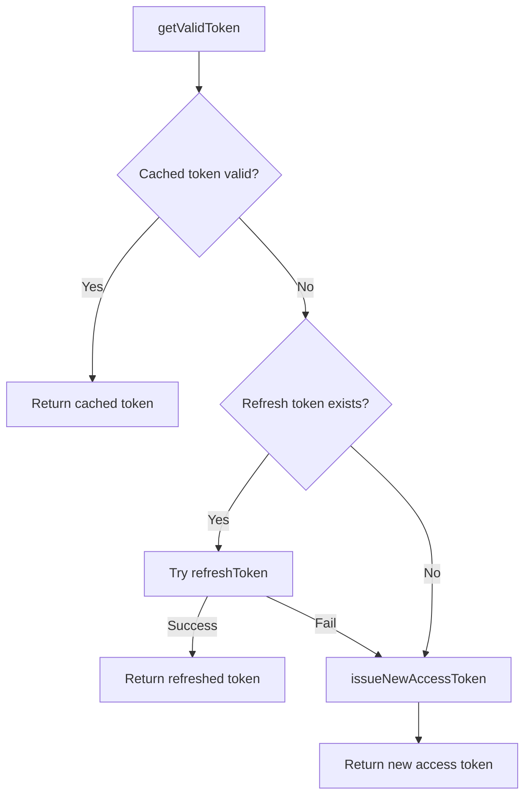
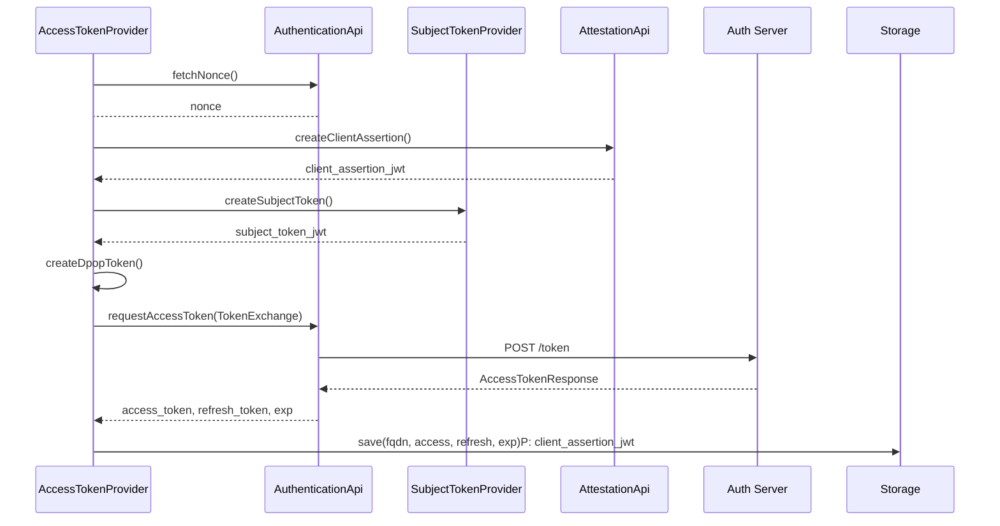

# Authentication Component

The Authentication component is responsible for obtaining, refreshing, and providing valid access tokens for accessing protected resources.
It performs three tasks:
1. Decide which token to use (cached, refreshed, or new)
2. Communicate with the Authorization Server (nonce + token request)
3. Create required cryptographic proofs (Subject Token, DPoP)

## Design
- **AccessTokenProviderImpl**: Produces a valid access token when requested.
- **AuthenticationApi**: Handles HTTP requests to the Authorization Server (nonce + token response).
- **SubjectTokenProvider**: Creates a signed subject_token (SMB or SMC-B).
- **AuthenticationStorage**: Stores access_token, refresh_token, and expiration timestamp.

**AccessTokenProviderImpl**

-getValidToken()
Decision logic for obtaining a valid token.

-issueNewAccessToken()

Used when no valid token exists. Steps:
1. Fetch nonce
2. Create client assertion (attestation)
3. Create signed subject token (SMB or SMC-B)
4. Create DPoP proof
5. Request new access/refresh token
6. Persist tokens

refreshToken()

Same pattern, but using grant_type=refresh_token.
Steps:
1. Fetch nonce
2. Create client assertion
3. Create DPoP
4. Request refreshed tokens
5. Persist tokens

**SubjectTokenProvider**

Abstraction for producing the subject_token used during token-exchange.

Two implementations:

SMB
* Loads certificate from local keystore (via TPM)
* Creates JWT and signs it locally

SMC-B
* Reads certificate via Connector API
* Signs token using externalAuthenticate

**AuthenticationApi**
* fetchNonce() -> GET nonce
* requestAccessToken() -> POST form data + DPoP header
* Parses OAuth token response
  No local state; only network calls.

**AuthenticationStorage**
stores by fqdn:
* access_token
* refresh_token
* expiration_timestamp
  Used by getValidToken() to decide whether to reuse, refresh, or obtain a new token
