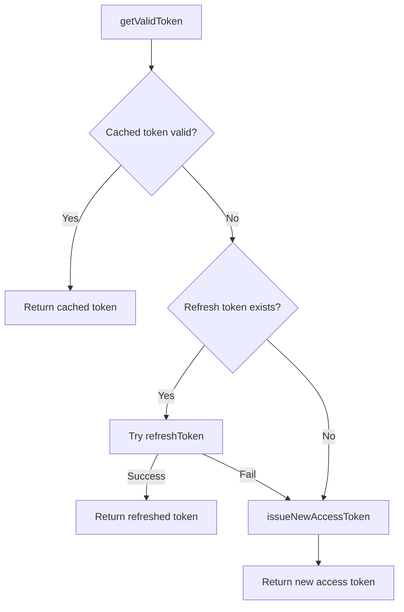
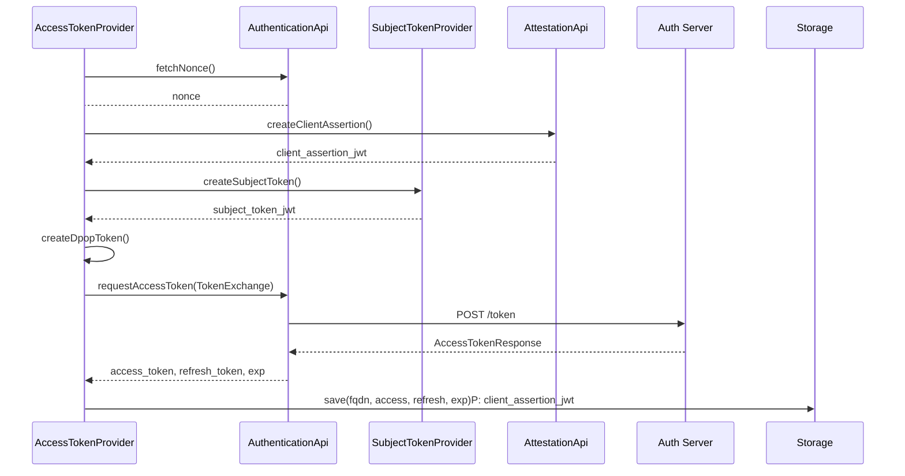
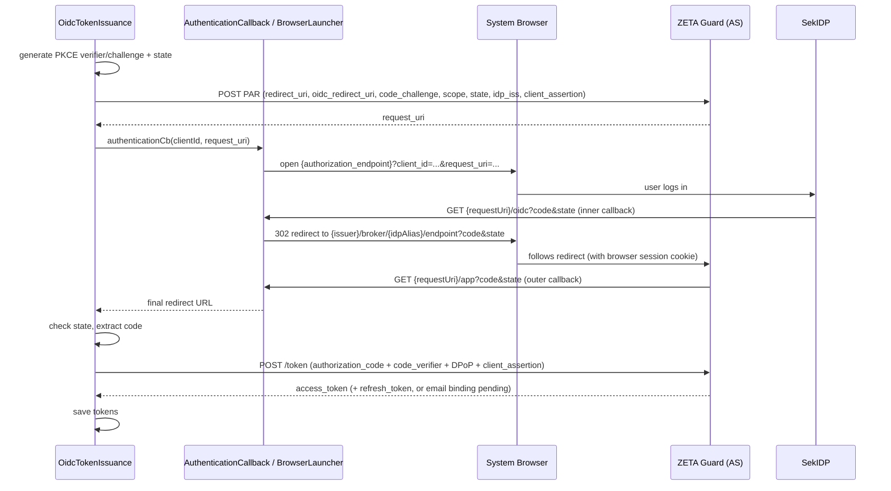

# Authentication Component

The Authentication component is responsible for obtaining, refreshing, and providing valid access tokens for accessing protected resources.
It performs three tasks:
1. Decide which token to use (cached, refreshed, or new)
2. Communicate with the Authorization Server (nonce + token request)
3. Create required cryptographic proofs (Subject Token, DPoP)

## Design
- **AccessTokenProviderImpl**: Produces a valid access token when requested.
- **AuthenticationApi**: Handles HTTP requests to the Authorization Server (nonce + token response).
- **SubjectTokenProvider**: Creates a signed subject_token (SMB or SMC-B).
- **AuthenticationStorage**: Stores access_token, refresh_token, and expiration timestamp.

**AccessTokenProviderImpl**

-getValidToken()
Decision logic for obtaining a valid token.


```mermaid
flowchart TD
A[getValidToken] --> B{Cached token valid?}
B -->|Yes| C[Return cached token]
B -->|No| D{Refresh token exists?}
D -->|Yes| E[Try refreshToken]
E -->|Success| F[Return refreshed token]
E -->|Fail| G[issueNewAccessToken]
D -->|No| G
G --> H[Return new access token]
```

-issueNewAccessToken()

Used when no valid token exists. Steps:
1. Fetch nonce
2. Create client assertion (attestation)
3. Create signed subject token (SMB or SMC-B)
4. Create DPoP proof
5. Request new access/refresh token
6. Persist tokens


```mermaid
sequenceDiagram
participant P as AccessTokenProvider
participant A as AuthenticationApi
participant S as SubjectTokenProvider
participant AT as AttestationApi
participant AS as Auth Server
participant ST as Storage

P->>A: fetchNonce()
A-->P: nonce

P->>AT:createClientAssertion()
AT-->>P: client_assertion_jwt

P->>S: createSubjectToken()
S-->>P:subject_token_jwt

P->>P: createDpopToken()

P->>A: requestAccessToken(TokenExchange)
A->>AS:POST /token
AS-->>A: AccessTokenResponse
A-->>P: access_token, refresh_token, exp

P->>ST: save(fqdn, access, refresh, exp)P: client_assertion_jwt
```

refreshToken()

Same pattern, but using grant_type=refresh_token.
Steps:
1. Fetch nonce
2. Create client assertion
3. Create DPoP
4. Request refreshed tokens
5. Persist tokens


**SubjectTokenProvider**

Abstraction for producing the subject_token used during token-exchange.

Two implementations:

SMB
* Loads certificate from local keystore (via TPM)
* Creates JWT and signs it locally

SMC-B
* Reads certificate via Connector API
* Signs token using externalAuthenticate


**AuthenticationApi**
* fetchNonce() -> GET nonce
* requestAccessToken() -> POST form data + DPoP header
* Parses OAuth token response
  No local state; only network calls.

**AuthenticationStorage**
stores by fqdn:
* access_token
* refresh_token
* expiration_timestamp
  Used by getValidToken() to decide whether to reuse, refresh, or obtain a new token

**OIDC**

> **Preview:** OIDC authentication (including email binding) is part of the ZETA 2.0 specification and still in preview — APIs and flows may change.

Alternative to the SMB/SMC-B subject token: the user authenticates interactively via the
OIDC Authorization Code Flow with PKCE and PAR. Configure it by passing an `OidcTokenProvider`
with an `OidcConfig` as `subjectTokenProvider` in `AuthConfig`:

```kotlin
data class OidcConfig(
    val idpIss: String,                  // issuer of the SekIDP, sent as idp_iss in the PAR request
    val idpAlias: String,                // IDP alias in the Keycloak broker chain
    val requestUri: String,              // base URI for the redirect callbacks (= browserLauncher.baseUri)
    val authenticationCallback: AuthenticationCallback? = null, // drives the browser step
    val otpCallback: OtpCallback,        // prompts for email / OTP during email binding
) {
    val requestUriApp: String get() = "$requestUri/app"    // outer flow callback (ZETA Guard)
    val requestUriOidc: String get() = "$requestUri/oidc"  // inner flow callback (SekIDP)
}
```

Two redirect URIs are derived from `requestUri` and registered as `redirect_uris` during DCR:
- `{requestUri}/oidc`: signals the completion of the inner flow (SekIDP)
- `{requestUri}/app`: signals the completion of the outer flow (ZETA Guard)

End-to-end flow (`OidcTokenIssuance.issue`):


```mermaid
sequenceDiagram
participant TI as OidcTokenIssuance
participant CB as AuthenticationCallback / BrowserLauncher
participant B as System Browser
participant G as ZETA Guard (AS)
participant IDP as SekIDP

TI->>TI: generate PKCE verifier/challenge + state
TI->>G: POST PAR (redirect_uri, oidc_redirect_uri, code_challenge, scope, state, idp_iss, client_assertion)
G-->>TI: request_uri
TI->>CB: authenticationCb(clientId, request_uri)
CB->>B: open {authorization_endpoint}?client_id=...&request_uri=...
B->>IDP: user logs in
IDP->>CB: GET {requestUri}/oidc?code&state (inner callback)
CB->>B: 302 redirect to {issuer}/broker/{idpAlias}/endpoint?code&state
B->>G: follows redirect (with browser session cookie)
G->>CB: GET {requestUri}/app?code&state (outer callback)
CB-->>TI: final redirect URL
TI->>TI: check state, extract code
TI->>G: POST /token (authorization_code + code_verifier + DPoP + client_assertion)
G-->>TI: access_token (+ refresh_token, or email binding pending)
TI->>TI: save tokens
```

1. `postPar()` sends the PAR request to `{issuer}/protocol/openid-connect/ext/par/request` with both redirect URIs (`redirect_uri`, `oidc_redirect_uri`), the PKCE challenge, `scope`, `state`, `idp_iss` and a client assertion. The AS returns a `request_uri`.
2. The `AuthenticationCallback` (e.g. `SystemBrowserAuthenticator` in `zeta-client`) opens `{authorization_endpoint}?client_id=...&request_uri=...` in the system browser. `BrowserLauncher` (expect/actual: implemented for JVM and macOS; Android/iOS pending) runs a local embedded Ktor server serving both callback paths:
   * `GET {requestUri}/oidc` (inner callback, SekIDP's code): relays code + state to the Guard's broker endpoint `{issuer}/broker/{idpAlias}/endpoint` via HTTP redirect. The browser follows it, carrying its own session cookie.
   * `GET {requestUri}/app` (outer callback, Guard's final code): completes `launchAndAwaitCallback()` and returns the raw request URI. Timeout: 5 minutes.
3. `authorize()` verifies the returned `state` and extracts the final `code`.
4. The code is exchanged at the token endpoint (`grant_type=authorization_code`, `code_verifier`, DPoP header, client assertion). Tokens are persisted via `AuthenticationStorage`.
5. If the token response scope contains `zeta:email-verify`, no refresh token is issued yet — the email binding flow runs first (see below).

All endpoints (PAR, authorization, broker, bind-email) are resolved lazily from the discovered
`issuer` by `OidcEndpointResolver` in the SDK core (`zeta-sdk/.../ZetaSdk.kt`), so discovery must
have run before the OIDC flow starts.

**Email binding (first authentication)**

For mobile clients the email address is bound on first use (TOFU). Trigger: the OIDC token
response contains the scope `zeta:email-verify` instead of a refresh token.
`OidcTokenIssuance.completeEmailBinding()` then runs:

1. If `binding_mode == "collect_email"`: ask the app for the email via `otpCallback.awaitEmail()` and `POST {issuer}/zeta/identity/bind-email` (response: `challenge_type=email_otp`, `email_hint`). Otherwise an email is already known and the OTP was sent.
2. OTP loop via `otpCallback.awaitOtp(emailHint, rejected)`:
   * `OtpSubmission.Otp(code)` -> `POST .../bind-email/verify`; on `status=bound` the loop ends, on a recoverable error the user is re-prompted with `rejected=true`.
   * `OtpSubmission.Resend` -> `POST .../bind-email/resend`.
3. The binding token is exchanged (`grant_type=token-exchange`) for the final access + refresh token, which are persisted.

The app supplies the interaction via `OtpCallback`:

```kotlin
interface OtpCallback {
    suspend fun awaitEmail(): String
    suspend fun awaitOtp(emailHint: String?, rejected: Boolean): OtpSubmission
}
```

Reference implementations: `GuiOtpCallback` (Compose UI, `zeta-client`) and
`TestDriverOtpCallback` (`zeta-testdriver`).

**Change email**

`ZetaSdkClient.changeEmail(newEmail)` changes the bound email address:

```kotlin
val result: Result<ChangeEmailResponse> = sdk.changeEmail("new@example.com")
```

It runs `discover()` and `register()` if needed, then `ChangeEmailClient` sends
`POST {issuer}/zeta/identity/email` with body `{"new_email": ...}`, authenticated by a TPM-signed
`Client-Assertion` header (`IdentityClientAssertionFactory`). Expected response: `202 Accepted`
with a `status` field; errors are RFC 7807 problem details, thrown as `ChangeEmailException`.

# TODOs:

## BrowserLauncher
- Implement BrowserLauncher with CustomTabs (BrowserLauncher.android.kt)
- Implement BrowserLauncher with ASWebAuthenticationSession (BrowserLauncher.ios.kt)

## Keycloak / ZetaGuardAuthorizationCodeGrantType
- Port the reduceScopes() fix (needsCollectEmail check) to the feature-mobile-client-registration-with-sekidp branch. Currently missing there, causing 401 on bind-email when binding_mode=collect_email
