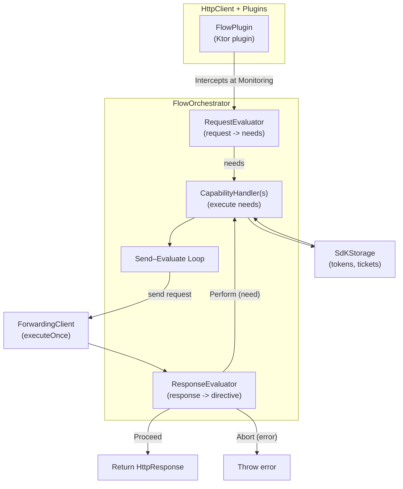

# Flow Component

Deterministic orchestration core for the SDK. It interprets HTTP responses and coordinates capability handlers
(e.g., device registration, authentication, attestation, etc).

## Design

- **FlowPlugin** — (Ktor plugin) Intercepts at HttpSendPipeline.Monitoring (after other plugins have mutated the request). Hands the original, still-mutable HttpRequestBuilder to the orchestrator, so retries don’t rebuild the request/body.
- **FlowOrchestrator** — The coordinator. It has two phases:
  1. Pre-send: calls RequestEvaluator -> gets zero or more needs to satisfy before the first network call (e.g., service discovery done, auth token). Executes each need via a matching CapabilityHandler. Handlers return:
     * Done -> no immediate retry (but any evaluator-supplied mutate can still run),
     * RetryRequest { mutate } -> apply mutate(request) and continue.
  2. Send–evaluate loop: executeOnce(request) -> ResponseEvaluator -> either:
     * Proceed(response) -> return to caller,
     * Perform(need, mutate?) -> run handler, apply mutations, loop,
     * Abort(error) -> throw.
- **RequestEvaluator** — Pure function: (request, storage) -> List<FlowNeed>. Typical logic: if route isn’t public and there’s no token -> [Authenticate].
- **ResponseEvaluator** — Pure mapping: (request, response) -> FlowDirective. E.g., 2xx -> Proceed, 40x -> Perform(Authenticate), others -> Abort.
- **CapabilityHandler** — Performs the side effect for a FlowNeed (e.g., call auth API, generate attestation, delay for backoff), optionally mutates the same request before retrying:
  * returns RetryRequest { req -> req.headers.append("Authorization", "Bearer …") } to alter the builder,
  * or Done if nothing to change immediately.
- **ForwardingClient** — Thin adapter with executeOnce(builder): sends the same HttpRequestBuilder and returns a real HttpResponse. In Ktor, it usually calls client.request(builder)—with a re-entry guard or a bypass client to avoid recursion.
- **SdkStorage** — Minimal key–value surface the handlers use to persist tokens/tickets between steps.

## How it works ?

1. FlowPlugin intercepts after other Ktor plugins and hands the request to the orchestrator.
2. RequestEvaluator checks if pre-send needs exist.
  * If yes -> the orchestrator runs matching CapabilityHandlers.
3. Enter the Send–Evaluate Loop:
  * Orchestrator calls ForwardingClient to execute the request once.
  * The ResponseEvaluator looks at the response:
    * Proceed -> return the response to the app.
    * Perform -> run a handler, mutate request, retry loop.
    * Abort -> throw the error.
4. SdkStorage is used by handlers to persist tokens, tickets, etc.
