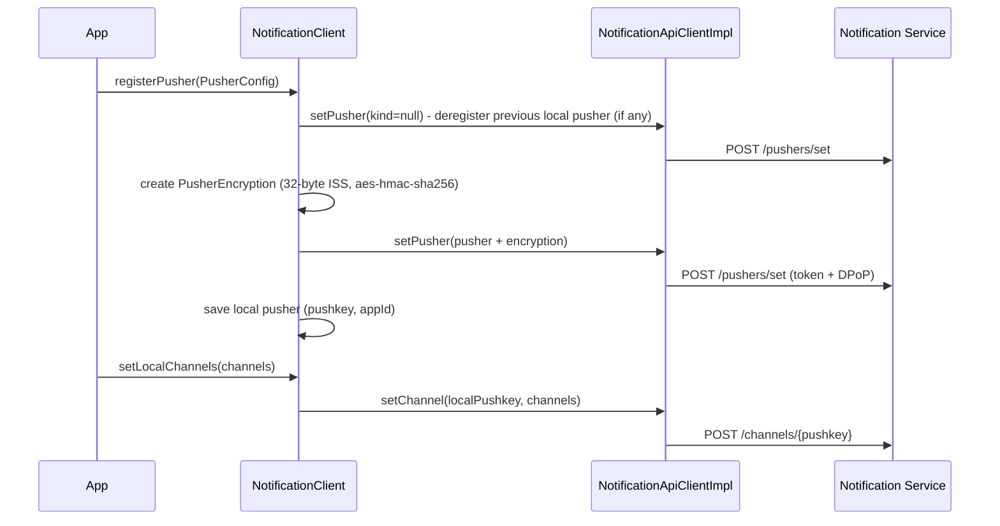

# Notifications Component

> **Preview:** push notifications are part of the ZETA 2.0 specification and still in preview — APIs and flows may change.

Client for the ZETA Notification Service (NS) that is co-deployed with the guard.
It manages pushers (push registrations of a device) and notification channels.
Receiving and displaying the actual push messages (FCM/APNs) is the job of the embedding app, not of this module.

## Design

- **NotificationClient**: Public interface the app uses. Operations: `getPushers`, `registerPusher`, `updatePusher`, `deletePusher`, `getAvailableChannels`, `getLocalChannels`, `setLocalChannels`.
- **NotificationApiClient / NotificationApiClientImpl**: HTTP contract to the NS device API (`GET /pushers`, `POST /pushers/set`, `GET /channels`, `GET`/`POST /channels/{pushkey}`). Adds per request:
  * a service-specific access token (`Authorization: dpop <token>`) with least-privilege scope per operation (`NotificationScopes`),
  * a fresh DPoP proof (`NotificationDpopProvider`).
  * On 401: invalidates the token and retries once. On 429: bounded backoff retry (`RateLimitRetryPolicy`). Errors map to `NotificationApiException` subtypes (400/401/403/429/other).
- **NotificationTokenProvider / ReauthNotificationTokenProvider**: Obtains the NS-specific access token (own `resource`/scopes, separate from the resource-server token).
- **LocalPusherStorage**: Remembers the pusher registered from this device, so channel operations don't need an explicit `pushkey`.
- **Models**: `Pusher`, `PusherConfig`, `PusherEncryption`, `Channel`.
- **NotificationConfig**: Enables and configures the integration (see Usage).

NS endpoints and their scopes (A_29979, normative scope table):

| Endpoint              | Method | Scope                                                            |
|-----------------------|--------|------------------------------------------------------------------|
| `/pushers`            | GET    | `notification.pusher.read`                                       |
| `/pushers/set`        | POST   | `notification.pusher.write`                                      |
| `/channels`           | GET    | `notification.channel.read`                                      |
| `/channels/{pushkey}` | GET    | `notification.channel.read`                                      |
| `/channels/{pushkey}` | POST   | `notification.channel.write`                                     |
| `/history/*`          | GET    | `notification.history.read` (optional NS feature; not yet implemented in this module) |

## How it works ?



1. The app registers the platform push token (e.g. FCM token) as `pushkey` via `registerPusher`. If a different pusher was registered from this device before, it is deregistered first (`kind = null`).
2. The SDK generates the ISS encryption key material and attaches it to the registration.
3. Channel operations (`getLocalChannels`, `setLocalChannels`) use the locally stored pushkey automatically.
4. Every NS call fetches a valid NS access token and signs a fresh DPoP proof. Discovery of the NS (well-known metadata) happens lazily on the first operation, not when the client is obtained.

## Usage

Notifications are opt-in. Pass a `NotificationConfig` in `BuildConfig`; `null` (the default) disables them entirely:

```kotlin
val sdk = ZetaSdk.build(
    resource,
    BuildConfig(
        // ...
        notificationConfig = NotificationConfig(), // defaults: wellKnownSubpath = "notification-service", apiBasePath = "/push/v1"
    ),
)

val notifications = sdk.notifications() // Android/iOS only
notifications.registerPusher(
    PusherConfig(pushkey = fcmToken, appId = "de.example.app"),
)
```

`NotificationConfig` fields:

| Field                | Default                  | Description                                                                 |
|----------------------|--------------------------|-----------------------------------------------------------------------------|
| wellKnownSubpath     | `notification-service`   | Subpath of the NS well-known metadata on the resource host, resulting in `https://{resource-host}/.well-known/oauth-protected-resource/{wellKnownSubpath}` |
| apiBasePath          | `/push/v1`               | API prefix of the NS at the PEP                                             |
| rateLimitRetryPolicy | `RateLimitRetryPolicy()` | Retry behaviour for 429 responses                                           |

Platform availability:
- `ZetaSdkClient.notifications()` exists on **Android and iOS** only (push transport is a mobile feature).
- JVM has an internal `notificationsForTesting()` used by the test driver.

Not implemented yet (calls throw):
- `decryptPushNotification`, `getNotification`, `getNotifications` (notification history).

Push transport (receiving messages) is not part of this module. The Android demo app in `zeta-client` shows an FCM integration (`ZetaFirebaseMessagingService`); there is no APNs integration yet.
