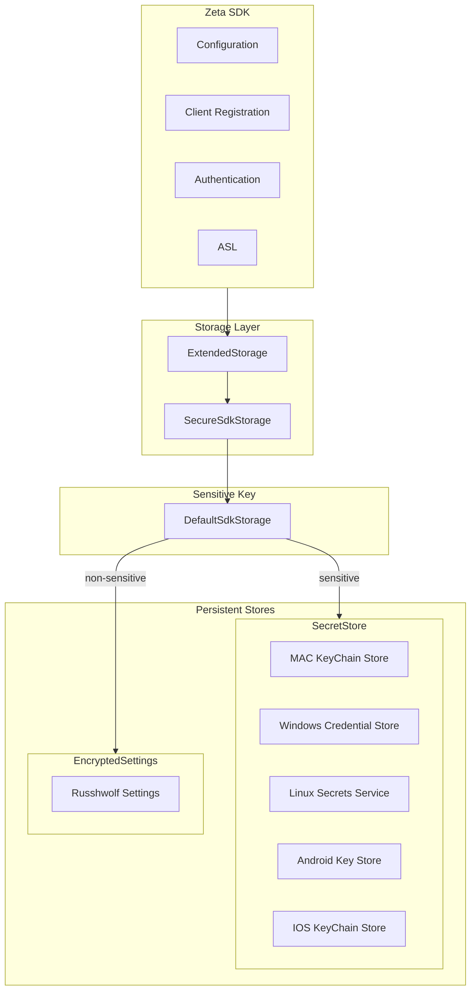

# Storage Component

Secure, cross-platform persistence for sensitive and non-sensitive data.
It abstracts “where/how to store secrets?” behind an API that works on all platforms.

## Design

- **SdkStorage**: Core storage abstraction the SDK:
  * Interface: put/get/remove/clear with String keys and values.

- **ExtendedStorage**: Convenience layer on top of SdkStorage:
  * Adds read/write/upsert of “string maps”:
    * getMap(key): MutableMap<String, String>? using Json.
    * upsertStringMap(key, mutate): load or create map, apply mutate, write back.
  * Uses JSON serialization.
  * Still exposes basic put/get/remove/clear so components can use it as a extended SdkStorage.

- **SecureSdkStorage**: Security implementation of SdkStorage:
  * Decides per key whether to store in:
    * SecretStore (OS keychain / secure enclave) for sensitive keys, or
    * EncryptedSettings (local encrypted preferences) for everything else.
  * On clear() it removes both the keychain namespace (if present) and the encrypted settings.

- **SecretStore**: Adapter for OS-native secret storage:
  * Interface: put/get/remove/clearNamespace.
  * On macOS: MacKeychainStore uses the security CLI to store secrets in the macOS Keychain.
  * On other OS (Linux/Windows/Android/iOS) it’s not yet implemented, falls back to EncryptedSettings.

- **EncryptedSettings** — Encrypted wrapper around russhwolf.settings.Settings:
  * Takes a Base64-encoded AES key (cipherB64Key) and an AesGcmCipher.
  * putString:
    1. value: UTF-8 bytes.
    2. AES-GCM encrypt.
    3. Prefix with a version byte.
    4. Base64-encode and store in underlying Settings.
  * getString:
    1. Read Base64, decode
    2. Check version and non-empty payload.
    3. Decrypt with AES-GCM, decode UTF-8, return.
    4. On failure: restores original stored string to avoid destroying data, and returns the raw stored value.
  * This functionality provides data-at-rest encryption even if OS keychain is not available.

- **provideSdkStorage** (JVM): Platform factory:
  * Creates PreferencesSettings from java.util.prefs.Preferences.userRoot().
  * Wraps it into EncryptedSettings with an AesGcmCipher and AES key passed as Base64.
  * Tries to build a SecretStore via createOsSecretStore("de.gematik.zeta.sdk"):
    * On macOS: MacKeychainStore backed by security CLI commands.
    * On Linux/Windows: Has to be implemented, so only EncryptedSettings is used.
  * Returns a SecureSdkStorage(settings = secureSettings, secrets = secretStore).

## How it works ?

1. Other components uses Storage by calling ExtendedStorage or SdkStorage.
2. ExtendedStorage:
  * For map operations: loads raw JSON via storage.get(key), parses into MutableMap, lets the caller mutate, then writes back JSON.
  * For simple values: forwards to storage.put/get/remove/clear.
3. SecureSdkStorage receives all put/get/remove/clear calls:
  * On put(key, value) it runs defaultSensitiveKeys(key):
    * If sensitive and SecretStore exists -> store in OS keychain.
    * Else -> store in EncryptedSettings.
  * On get/remove it applies the same routing so reads/writes stay consistent.
  * On clear() it:
    * Calls secrets?.clearNamespace() (once implemented).
    * Calls settings.clear() for the encrypted preferences.
4. EncryptedSettings:
  * On write: encrypts with AES-GCM, then Base64-encodes.
  * On read: decodes, decrypts.
5. Platform factory (provideSdkStorage):
  * On JVM: builds PreferencesSettings on top of Preferences.userRoot().
  * Wraps it with EncryptedSettings and tries to attach a SecretStore:
    * On macOS -> MacKeychainStore that uses the security CLI to find/add/delete generic passwords under a shared service name.
    * On unsupported OS -> null, so only EncryptedSettings is used.
